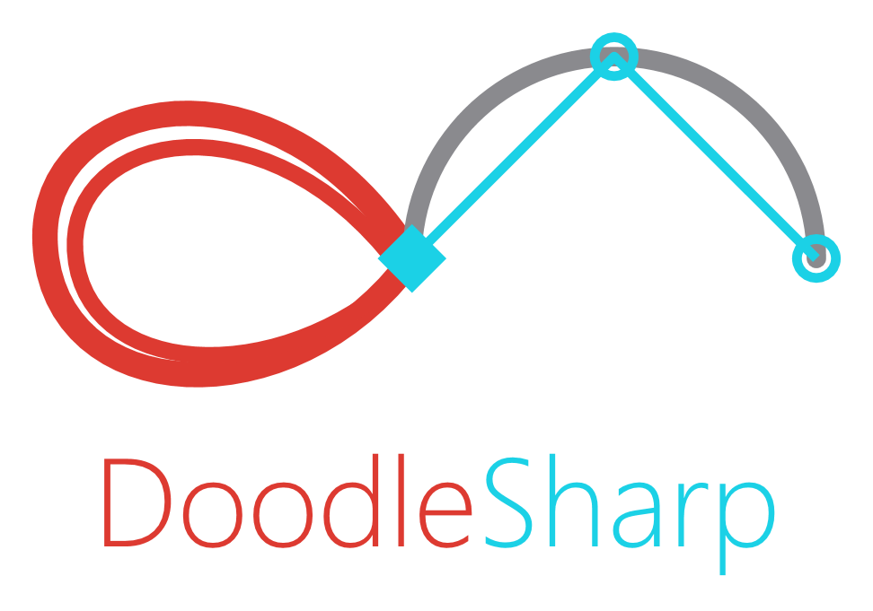

<p align="center">
  
</p>

# DoodleSharp - 2D Geometry Visualizer

A WPF application for visualizing 2D geometric shapes through C# code execution with animation support.

## Overview

DoodleSharp is a visual programming environment that lets you write C# code to create, style, and animate 2D geometric shapes on an interactive canvas. It combines a code editor with syntax highlighting, a real-time rendering canvas with zoom and pan capabilities, and a timeline-based animation system with GIF export.

## Features

- **Live Preview**: Canvas updates automatically as you type (debounced auto-run)
- **No Placement Call Required**: Shapes appear automatically when created
- **C# Code Editor**: Roslyn-powered IntelliSense, semantic highlighting, refactoring, and squiggle diagnostics
- **Rich Shape Library**: Points, lines, circles, rectangles, ellipses, arcs, polygons, polylines, Bezier curves, splines, regions (curve-bounded areas), hatches (pattern fills), text, arrows, and dimension annotations
- **Charts**: Built-in `Chart.Bar/Line/Scatter/Pie/Area` helpers produce ready-to-render chart groups (axes, ticks, labels, palette) from raw data
- **Geometry Operations**: Clipper2-backed boolean ops and offsets on polygons and curve-bounded regions, array/pattern generators, curve intersection, and a BVH-accelerated `RayCaster` for ray queries over millions of shapes
- **Shape Editing**: Select shapes and drag shape-specific control points (vertices, radius handles, curve controls) with live code sync
- **Properties Panel**: Floating or dockable panel to edit geometry and style properties (color, fill, weight, opacity, visibility, name) with full code sync — changes persist as code lines
- **Global Parameters**: Declare named values once with `GlobalParameters.Set(...)`, read them anywhere, and tune them live from a sidebar of sliders and checkboxes — the canvas re-runs as you drag and the new value is written back into your code
- **Animation System**: Create timeline-based animations with draw, move, rotate, flip, and fade effects
- **Interactive Canvas**: Zoom with mouse wheel, pan with middle-click, toggle grid display
- **Export Options**: Save visualizations as PNG images, animated GIFs, or MP4 videos
- **Project Management**: Organize multiple code files into projects with tabbed editing, drag-and-drop file organization, and "Go to Location" to open files in Windows Explorer
- **Auto Save**: Optionally write every modified file to disk on a timer, with a prompt to pick a location if the project has never been saved
- **Diagnostic Journals**: Every session writes a detailed, crash-proof journal to `%TEMP%\DoodleSharp` — machine and GPU details, every file opened, every run, and full exception chains — so a crash on any machine can be diagnosed from one file. See [Diagnostic Journals](#diagnostic-journals)
- **NuGet Integration**: Add external packages to extend functionality
- **Built-in Help**: Comprehensive API documentation with examples
- **Code Minimap**: VSCode-style minimap with syntax coloring, viewport indicator, and error marker navigation

---

## Quick Start

### 1. Create a New Project
File > New Project (Ctrl+Shift+N) creates a new project with a starter template.

Existing projects open from the welcome screen, from File > Open Project (Ctrl+O), or by
**double-clicking a `.vizproj` file** in Explorer — the installer associates the file type, and
DoodleSharp opens straight into that project with its entry-point file loaded.

### 2. Write Your Code
The entry point is `StartViz.Viz.Main()` in `StartViz.cs`:

```csharp
using C2VGeometry;

namespace StartViz
{
    public class Viz
    {
        public static void Main()
        {
            // Shapes appear automatically when created - no placement call needed!
            var circle = new VCircle(0, 0, 50);
            circle.Color = "Cyan";
            circle.FillColor = "#4000FFFF";
        }
    }
}
```

### 3. See Results Instantly
With **Auto-update Canvas** enabled (default), the canvas updates automatically as you type - no need to press Run!

- **Auto-update**: Canvas refreshes 500ms after you stop typing
- **Manual mode**: Disable auto-update in Settings to use F5/Run button instead
- **Auto-Draw Shapes**: Toggle in Settings > Canvas Settings to control whether shapes auto-register on construction
- **No explicit placement needed**: Shapes appear when created. `Place()` is there for the ones that don't come from a plain `new` — method results, query results, anything built while auto-register was off. (`Draw()` is the historical name for the same call and still works.)

---

## Supported Shapes

| Shape | Description | Constructor Examples |
|-------|-------------|---------------------|
| **VXYZ** | Coordinate/vector type (like Revit's XYZ) — not a shape, never drawn | `new VXYZ(x, y)` or `new VXYZ(x, y, z)` |
| **VPoint** | A visible point marker on the canvas | `new VPoint(x, y)` or `new VPoint(vxyz)` |
| **VLine** | A line segment | `new VLine(p1, p2)`, `new VLine(x1, y1, x2, y2)` or `new VLine(start, angleDegrees, length)` |
| **VXLine** | An infinite construction line | `new VXLine(basePoint, direction)` (the second argument is a **direction**) or `new VXLine(x1, y1, x2, y2)` (through **two points**) |
| **VRay** | A semi-infinite ray | `new VRay(origin, direction)` (the second argument is a **direction**) or `new VRay(ox, oy, tx, ty)` (origin **through** a point) |
| **VCircle** | A circle | `new VCircle(center, radius)`, `new VCircle(x, y, radius)` or `new VCircle(p1, p2, p3)` (circumcircle) |
| **VRectangle** | A rectangle (inherits from VPolygon) | `new VRectangle(corner, width, height)`, `new VRectangle(x, y, width, height)` or `new VRectangle(bottomLeft, topRight)` |
| **VEllipse** | An ellipse or elliptical arc | `new VEllipse(center, radiusX, radiusY)` or `new VEllipse(center, rx, ry, startAngle, endAngle)` |
| **VArc** | A circular arc | `new VArc(center, radius, startAngle, endAngle)` or `new VArc(start, mid, end)` |
| **VPolygon** | A closed polygon | `new VPolygon(p1, p2, p3, ...)` or `new VPolygon(listOfCurves)` |
| **VPolyline** | Open connected segments | `new VPolyline(p1, p2, p3, ...)` |
| **VBezier** | Cubic Bezier curve | `new VBezier(start, ctrl1, ctrl2, end)` or `new VBezier(x0,y0, x1,y1, x2,y2, x3,y3)` |
| **VSpline** | Smooth Catmull-Rom curve through every point | `new VSpline(p1, p2, p3, ...)` |
| **VText** | Text at a position | `new VText(position, "text")` or `new VText(x, y, "text", height)` |
| **VArrow** | Arrow with head | `new VArrow(start, end)`, `new VArrow(x1, y1, x2, y2)` or `new VArrow(start, direction, length)` |
| **VDimension** | Dimension annotation with arrowheads | `new VDimension(p1, p2)` or `new VDimension(x1, y1, x2, y2)` |
| **VRadialDimension** | Radial/diameter dimension | `new VRadialDimension(circle)` or `new VRadialDimension(arc)` |
| **VGroup** | Group of shapes | `new VGroup(shape1, shape2, ...)` or `new VGroup(shapeList)` |
| **VGrid** | Grid of visible VPoints | `new VGrid(location, xcount, ycount, spacing)` |
| **VCell** | Square cell with neighbours | Created by `VSpatialGrid` |
| **VSpatialGrid** | Grid of cells with A* pathfinding | `new VSpatialGrid(location, xCount, yCount, cellSize)` |
| **Region** | Curve-bounded region | `new Region(curves)`, `new Region(outerCurves, holes)`, or `new Region(closedCurve)` |
| **VHatch** | Pattern fill within boundary | `new VHatch(polygon, BuiltInHatch.ANSI31, scale)` |

> **VXYZ vs VPoint**: `VXYZ` is the coordinate/vector type used for all position parameters, properties, and return types (e.g., `new VXYZ(10, 20)`). It is immutable and never appears on the canvas, so it is safe for intermediate maths. `VPoint` is a *shape* that draws a dot — constructing one adds a marker to the canvas. Use `new VXYZ(x, y)` wherever you just need a coordinate.

> **Coordinates**: the origin `(0, 0)` is the centre of the canvas and **Y points up** (mathematical convention, not screen convention). Angles are in **degrees**, measured counter-clockwise from the positive X axis, unless a member says otherwise.

> **`VXLine` and `VRay` take a direction, not a second point.** There is no
> `VXLine(VXYZ, VXYZ)` "through two points" overload and no `VRay(VXYZ origin, VXYZ throughPoint)`.
> Both two-`VXYZ` constructors read their second argument as a **direction vector** (normalised for
> you), so passing a target point compiles cleanly and silently aims the line somewhere else. The
> four-coordinate overloads are the through-two-points forms. If you already hold two `VXYZ`,
> subtract:
> ```csharp
> var p1 = new VXYZ(50, 50);
> var p2 = new VXYZ(100, 75);
> var ray   = new VRay(p1, p2 - p1);      // correct: aims at p2
> var xline = new VXLine(p1, p2 - p1);    // correct: passes through both
> var oops  = new VRay(p1, p2);           // compiles — but direction is (100, 75), not (50, 25)
> ```

### Properties every shape has

Inherited from `Shape`, so they work on all of the types above.

| Property | Type | Default | Notes |
|----------|------|---------|-------|
| `Color` | string | `"Cyan"` | Stroke. Named color, `#RRGGBB` or `#AARRGGBB`. Some shapes override the default (VPoint → White, VCircle → Yellow, VPolygon → LightBlue, VRectangle → Magenta, VArc → Orange). |
| `FillColor` | string | `"Transparent"` | Fill for closed shapes |
| `LineWeight` | double | `2.0` | Stroke thickness — world units by default, screen pixels in absolute mode |
| `LineType` | LineType | `Continuous` | Dash pattern (8 values) |
| `LineTypeScale` | double | `1.0` | Stretches or compresses the dash pattern |
| `Opacity` | double | `1.0` | 0 = invisible, 1 = opaque; multiplies any alpha in the colors |
| `Name` | string | `""` | Label — also keeps the shape from being auto-hidden after `Main()` |
| `Id` | long | auto | Unique, read-only; the counter restarts each run |
| `IsVisible` | bool | `true` | `Hide()` / `Show()` toggle it; hidden shapes stay in the collection |
| `IsSelected` | bool | `false` | True while the shape is selected on the canvas |
| `IsExplicitlyDrawn` | bool | `false` | Set by `Place()` (or its historical alias `Draw()`); exempts an unnamed shape from auto-hide |
| `IsPlaced` | bool | `false` | True once the shape has been registered with the canvas. Set for you on construction; the animation system checks it before auto-drawing a target |
| `DrawFactor` | double | `1.0` | 0–1, progressive-drawing animation |
| `OffsetX` / `OffsetY` | double | `0` | Translation offsets used by `MoveAnimation` |
| `RotationAngle` | double | `0` | Degrees counter-clockwise, written by `RotateAnimation`. Applied as a render transform about `RotationPivot`, uniformly for every shape type. `VRectangle` is the exception: it **overrides** the property to rebuild its four corners, so its rotation is baked into the geometry |
| `RotationPivot` | VXYZ? | `null` | Null means the shape's own centre |
| `FlipProgress` / `FlipAxis` | double / VLine? | `0` / `null` | Used by `FlipAnimation` |

#### Static members on `Shape`

These configure the whole run rather than one shape. They are reset for you between runs, so you only
touch them to change behaviour deliberately.

| Member | Type | Description |
|--------|------|-------------|
| `Shape.DefaultRegistry` | `IShapeRegistry?` | The canvas every constructor registers with. DoodleSharp sets it to its renderer at start-up; setting it to `null` makes shapes purely computational |
| `Shape.AutoRegister` | bool | When false, constructors stop registering — the switch behind the **Auto-Draw Shapes** setting. Shapes built while it is off need `Place()` to appear |
| `Shape.DefaultColor` | string | `"Cyan"` — the fallback stroke for shapes that do not define their own |
| `Shape.DefaultFillColor` | string | `"Transparent"` |
| `Shape.DefaultLineWeight` | double | `2.0` |
| `Shape.DefaultLineType` | LineType | `Continuous` |
| `Shape.DefaultLineTypeScale` | double | `1.0` |
| `Shape.ResetDefaults()` | void | Puts the five `Default*` values back to the above |
| `Shape.ResetIdCounter()` | void | Restarts `Id` at 1. Called automatically at the start of each run, which is why IDs are stable between runs |

Ordering and lifetime methods on an individual shape: `Place()`, `Remove()`, `Show()` / `Hide()`,
`BringAbove(other)` and `SendBehind(other)`.

#### `Place()` — put a shape on the canvas and keep it there

```csharp
shape.Place();     // on the canvas, and safe from the post-run cleanup
shape.Remove();    // the inverse
```

One rule covers every case: **`Place()` puts a shape on the canvas and keeps it there.** It registers
the shape with the canvas and sets `IsExplicitlyDrawn`, which exempts it from the pass that hides
unnamed shapes after `Main()` returns. It is idempotent, so calling it twice — or on a shape that is
already placed — is harmless, and `Remove()` undoes it.

You need it whenever a shape did not come from a plain `var x = new VShape(...)` in your own code:

- results of boolean operations, `ArrayOps`, `Chart` and other methods, which are registered but
  unnamed and would otherwise be swept away (setting `Name` works equally well)
- shapes returned by the query methods that deliberately do not draw their answer —
  `GeometryHelper.IntersectLineLine` and friends, `VRay.ToFiniteLine()`, `VRay.ToXLine()`,
  `VXLine.ToFiniteLine()`
- anything built while `Shape.AutoRegister` was false

**`Draw()` is the historical name for `Place()` and does exactly the same thing** — it is a
one-line forward, pinned by a test. **Existing files that call `Draw()` keep working unchanged, and
there is nothing to migrate**: the two calls are identical. New code reads better with `Place()`,
which says what happens — shapes render because they are registered, not because something was
"drawn" — and it is what the drawing tools and editor snippets now write for you.

#### `CopyStyleTo(target)` — carry styling onto another shape

```csharp
var a = new VPolygon(new VXYZ(0, 0), new VXYZ(100, 0), new VXYZ(100, 100), new VXYZ(0, 100))
{
    Color = "Tomato", FillColor = "#40FF6347", LineWeight = 3
};
var b = new VPolygon(new VXYZ(50, 50), new VXYZ(150, 50), new VXYZ(150, 150), new VXYZ(50, 150));

VPolygon? merged = a.Union(b);   // a method result: unnamed, and with default styling
a.CopyStyleTo(merged);           // now it looks like its input
merged?.Place();
```

Copies the five styling members — `Color`, `FillColor`, `LineWeight`, `LineType`, `LineTypeScale` —
and nothing else: geometry, `Name`, `Id` and visibility are left alone. It returns the target, so it
chains, and it is a no-op when the target is `null` or is the source itself. That null-safety is what
makes it comfortable with boolean results, which legitimately come back `null`.

#### Host seams

C2VGeometry has no UI of its own, so two interfaces are supplied by the application and are the
reason shapes and text work at all. You almost never implement them — they are documented so the
plumbing is not a mystery.

| Interface | Set through | Members | Purpose |
|-----------|-------------|---------|---------|
| `IShapeRegistry` | `Shape.DefaultRegistry` | `Register(shape)`, `Unregister(shape)`, `MoveAbove(shape, reference)`, `MoveBehind(shape, reference)` | What a constructor calls, so shapes appear without an explicit placement call. `Place()`, `Remove()`, `BringAbove()` and `SendBehind()` are thin wrappers over these four |
| `IGlyphOutlineProvider` | `VText.GlyphOutlineProvider` | `GetCharContours(text, charIndex)` → `List<List<VXYZ>>?` | Turns a character into closed contours in world coordinates, honouring font, height, anchor and rotation. One inner list per contour (an `O` has two). Returns null for whitespace — and with no provider set, `ToCharShape` / `LiftChar` / `LiftChars` all return null |

The third seam is `GeometryDiagnostics.Sink` — see [Why a Union returned null](#why-a-union-returned-null).

#### Members specific to each shape

Beyond the constructors above and the `ICurve` members every curve shares.

| Shape | Members |
|-------|---------|
| **VLine** | `Start` / `End` (settable `VXYZ` — there is no `StartPoint`/`EndPoint` on a concrete `VLine`), `MidPoint`, `Direction` (unit vector) |
| **VCircle** | `Center`, `Radius`, `Diameter` (get/set, `2 × Radius`; setting it resizes about the centre, `Center` does not move), `Area`, `Circumference`. Statics: `FromCenterDiameter(center, diameter)`, `FromCenterDiameter(cx, cy, diameter)`, `FromTwoPoints(p1, p2)` (the two points are the ends of a diameter) |
| **VArc** | `Center`, `Radius`, `StartAngle`, `EndAngle`, `MidPoint`, `Evaluate(t)`. Nine statics: `FromStartCenterEnd`, `FromCenterStartEnd`, `FromStartCenterAngle`, `FromCenterStartAngle`, `FromStartCenterLength`, `FromCenterStartLength`, `FromStartEndRadius(start, end, radius, largeArc = false)`, `FromStartEndAngle`, and `Continue(previousCurve, arcLength)` — which starts tangent to the curve you pass |
| **VEllipse** | `Center`, `RadiusX`, `RadiusY`, `StartAngle`, `EndAngle`, `Area`, `Circumference`, `Evaluate(t)` (arc-length), `EvaluateByAngle(t)` (angle-linear — use it for spokes and sector edges) |
| **VRectangle** | `Corner` (bottom-left), `Width`, `Height`, `RotationAngle`. Setting any of them rebuilds the four points; everything on `VPolygon` is inherited |
| **VPolygon** | `Points` (mutable), `Curves`, `Area`, `SignedArea`, `AddPoint(point)` / `AddPoint(x, y)`, `Slice(linePoint1, linePoint2)` → `List<VPolygon>` cut along the infinite line through the two points. Area-preserving (the pieces sum back to `Area`), so a concave polygon crossed more than twice returns three or more pieces; a line that misses or merely grazes returns one. See [Slicing a polygon](#slicing-a-polygon) |
| **VPolyline** | `Points` (mutable), `PointCount` (`Points.Count`, null-safe), `AddPoint(point)` / `AddPoint(x, y)` |
| **VBezier** | `P0`, `P1`, `P2`, `P3` (settable), `MidPoint`, `Segments` (tessellation, default 32), `Evaluate(t)` (Bernstein, **not** arc-length), `GetRenderPoints()` |
| **VSpline** | `ControlPoints`, `SegmentsPerSpan` (default 16), `Tension` (default 0.5 — 0 is angular, 1 is loose), `Evaluate(t)`, `GetRenderPoints()` |
| **VArrow** | `Start` / `End` (settable), `MidPoint`, `HeadLength` (default 15 world units), `HeadAngle` (default 30° half-angle), `DoubleEnded` (default false), `GetStartArrowhead()` / `GetEndArrowhead()` → the two wing tips as a `(VXYZ, VXYZ)` tuple. Not an `ICurve` |
| **VRay** | `Origin`, `Direction`, `RenderExtent` (default 10000 — how far it is drawn and how its bounds are computed, since it is infinite), `GetPointAtDistance(d)`, `ContainsPoint(p)`, `ToFiniteLine()` → `VLine`, `ToXLine()` → `VXLine`. Statics: `AtAngle(origin, degrees)`, `HorizontalRight`, `HorizontalLeft`, `VerticalUp`, `VerticalDown` |
| **VXLine** | `BasePoint`, `Direction`, `RenderExtent`, `GetPointAtParameter(t)` (unclamped — negative `t` goes backwards), `GetTwoPoints()` → `(VXYZ, VXYZ)` (handy for `VPolygon.Slice`), `ToFiniteLine()` → `VLine`. Statics: `Horizontal(y)`, `Vertical(x)` |

> **The conversions return an undrawn shape.** `VRay.ToFiniteLine()`, `VRay.ToXLine()` and
> `VXLine.ToFiniteLine()` hand back a real `VLine`/`VXLine` you can measure, intersect and pass
> around, but it is deliberately **not** placed on the canvas — converting a ray for a calculation
> should not add a second line to your drawing. Call `.Place()` on the result if you do want to see
> it. The same holds for `GeometryHelper`'s three `Intersect*` methods.
| **VText** | `Content`, `Location`, `Height`, `Width`, `Font`, `FontWeight`, `Anchor`, `Angle`, `ToCharShape(i)`, `LiftChar(i)`, indexer `text[i]`, `LiftChars(start, count)`, `BlankChar(i)`, `GetAnchorOffset(w, h)` → the `(dx, dy)` the anchor applies. Static `GlyphOutlineProvider` is the font seam the host fills in |
| **VGroup** | `Shapes`, `Count`, indexer `group[i]`, `Add`, `AddRange`, `Remove(shape)`, `RemoveAt(i)`, `Clear()`, `ContainsShape`, `Flatten()`, `ForEach`, `Where`, `GetShapesOfType<T>()`, `GetCenter()`, `SetOpacity`, `ApplyStyle` / `ApplyColor` / `ApplyFillColor` / `ApplyLineWeight` |
| **VGrid** | `Points`, `Count`, indexers `grid[i]` and `grid[col, row]`, `GetRow` / `GetColumn`, `GetCenter()`, `Location`, `XCount` / `YCount`, `XSpacing` / `YSpacing`, `Centered`, `ApplyStyle()` |
| **VSpatialGrid** | `Cells`, `Count`, indexers `grid[i]` and `grid[col, row]`, `GetRow` / `GetColumn`, `GetCenter()`, `GetCellAt(point)`, `GetClosestCell(point)`, `FindPath(start, end)`, `Location`, `XCount` / `YCount`, `CellSize`, `ApplyStyle()` |
| **VHatch** | `Boundary` (`List<VXYZ>`, settable), `Pattern`, `PatternScale`, `PatternAngle`, `GenerateLines()` → the clipped `(Start, End)` segments, static `FromDefinition(...)` |
| **VDimension** | `Point1` / `Point2` (settable), `Distance`, `DisplayText`, `ExtensionLength`, `GetDimensionGeometry()` → a 7-tuple of `VXYZ` (the extension- and dimension-line endpoints as drawn), plus the style properties in [Dimensions](#dimensions-vdimension) |
| **VRadialDimension** | `Center`, `Radius`, `LeaderAngle`, `ShowDiameter`, `Value`, `DisplayText`, `GetDimensionGeometry()` → a 3-tuple of `VXYZ` (the leader geometry) |
| **VPoint** | `X`, `Y`, `AsVXYZ()`, implicit conversion to `VXYZ`, and the full `+ - * /` operator set — every one of which returns a plain `VXYZ`, so intermediates never draw |

Two conversion helpers worth knowing: `PolygonWithHoles.FromPolygonList(polygons)` sorts a flat list
into outers and holes by winding, and `Region.SampleLoop(loop, segmentsPerCurve)` flattens one
`List<ICurve>` boundary loop into plain vertices — the same sampling the region boolean ops use.

---

## Charts (Chart Class)

`Chart` is a static helper that builds Chart.js-style charts out of standard C2VGeometry primitives. Each method returns a `VGroup` containing axes, gridlines, ticks, tick labels and the data shapes — the chart is rendered, selected, moved and styled as a single unit. Axis ranges auto-fit from the data using "nice" round-number tick spacing. No new shape types or canvas changes were added.

### Chart methods

| Method | Returns | Description |
|--------|---------|-------------|
| `Chart.Bar(string[] labels, double[] values, ChartOptions? opts = null)` | VGroup | Categorical bars with numeric Y axis. Bars fill 70% of their slot and cycle through `Palette`. Y always includes zero unless you pin `YMin`/`YMax`. Throws `ArgumentException` if the two arrays differ in length |
| `Chart.Line(double[] xs, double[] ys, ChartOptions? opts = null)` | VGroup | Polyline through the points plus a marker on each, in `Palette[0]`. Both axes numeric. Throws `ArgumentException` on mismatched lengths |
| `Chart.Scatter(VXYZ[] points, ChartOptions? opts = null)` | VGroup | Scatter plot; each point's X/Y are **data values**, not canvas coordinates |
| `Chart.Pie(double[] values, string[]? labels = null, ChartOptions? opts = null)` | VGroup | Pie chart from 12 o'clock, clockwise, sized by share of the total. Negative and zero values are skipped; a non-positive total draws nothing. Sectors are polygon-approximated (~4° per segment — there is no `VSector` shape). No axes are drawn |
| `Chart.Area(double[] xs, double[] ys, ChartOptions? opts = null)` | VGroup | Filled area down to the baseline plus a stroked top edge. Needs at least two points. Throws `ArgumentException` on mismatched lengths |

The data you pass is in **data units**. The chart maps it into the plot rectangle described by
`Origin`, `Width` and `Height`, which *are* world coordinates (Y up, origin at the canvas centre).

> **Name your chart.** The `VGroup` comes back from a method call, not a `new VGroup(...)`, so the
> auto-naming pass does not reach it and the post-run "hide unnamed shapes" sweep removes it. Set
> `chart.Name = "..."` (as the examples below do) — or call `chart.Place()` — to keep it on screen.

### ChartOptions

| Property | Default | Description |
|----------|---------|-------------|
| `Origin` | `(0, 0)` | Bottom-left of plot area in world coordinates |
| `Width` / `Height` | 400 / 250 | Plot area size |
| `Title` | null | Chart title above the plot |
| `XAxisTitle` / `YAxisTitle` | null | Axis titles |
| `XMin` / `XMax` / `YMin` / `YMax` | null (auto-fit) | Pin a fixed axis range |
| `XTickCount` / `YTickCount` | 6 / 6 | *Approximate* tick count — the nice-number rounding decides the real one. Values below 2 are clamped to 2 |
| `ShowGrid` | true | Light gridlines behind the chart |
| `ShowLegend` | false | Draw a legend down the right of the plot area — a colour swatch and label per entry, in `Palette` order. Honoured by `Chart.Bar` (one entry per category) and `Chart.Pie` (one per slice, and only when you supply `labels`). `Line`, `Scatter` and `Area` ignore it: they draw a single series in one colour, so a one-row legend would say nothing. Blank labels are skipped |
| `XLabelRotation` | 0 | Rotation of X tick labels in degrees (good for long category names); any non-zero value also right-aligns them |
| `LabelFontSize` / `TitleFontSize` | 10 / 14 | Text sizes. Axis titles are drawn one unit larger than `LabelFontSize` |
| `AxisColor` / `GridColor` / `TextColor` | "White" / "DimGray" / "White" | Colors |
| `Palette` | 10-color qualitative | Colors cycled across bars / slices (`Palette[i % Length]`). Line, Area and Scatter use `Palette[0]` only |
| `TickDecimalPlaces` | null (auto) | Fixed decimals on numeric ticks. Auto = up to 3 decimals, switching to `G3` beyond 1e6 or below 1e-3 |

### Per-chart-type examples

Each example is self-contained — paste into DoodleSharp's editor and press F5.

**Bar — categorical values with a numeric Y axis.**

```csharp
var labels = new[] { "Q1", "Q2", "Q3", "Q4" };
var values = new[] { 120.0, 150, 95, 180 };

var revenue = Chart.Bar(labels, values, new ChartOptions
{
    Origin = new VXYZ(-250, -150),
    Width = 500,
    Height = 300,
    Title = "Quarterly Revenue (M$)",
    YAxisTitle = "Revenue",
    YMin = 0,                       // pin the Y axis to zero instead of auto-fitting
    TickDecimalPlaces = 0
});
revenue.Name = "revenue";           // charts are method results — name them or they get hidden
```

**Line — computed time series, auto-fit ranges.**

```csharp
var xs = Enumerable.Range(0, 60).Select(i => i * 0.1).ToArray();           // 0.0, 0.1, ... 5.9
var ys = xs.Select(x => Math.Exp(-0.3 * x) * Math.Sin(2 * x)).ToArray();    // damped oscillator

var trace = Chart.Line(xs, ys, new ChartOptions
{
    Origin = new VXYZ(-300, -150),
    Width = 600,
    Height = 300,
    Title = "Damped Oscillator",
    XAxisTitle = "Time (s)",
    YAxisTitle = "Amplitude",
});
trace.Name = "trace";
```

**Scatter — correlated random sample.**

```csharp
var rng = new Random(42);
var sample = Enumerable.Range(0, 80)
    .Select(_ =>
    {
        double age = rng.NextDouble() * 40 + 20;                  // 20-60 yrs
        double height = age * 0.4 + 150 + rng.NextDouble() * 20;  // cm, mildly correlated
        return new VXYZ(age, height);
    })
    .ToArray();

var scatter = Chart.Scatter(sample, new ChartOptions
{
    Origin = new VXYZ(-250, -150),
    Width = 500,
    Height = 300,
    Title = "Height vs Age",
    XAxisTitle = "Age",
    YAxisTitle = "Height (cm)"
});
scatter.Name = "scatter";
```

**Pie — named slices, custom palette.**

```csharp
var browserShare = new[] { 64.7, 19.5, 9.3, 3.5, 3.0 };
var browsers     = new[] { "Chrome", "Safari", "Edge", "Firefox", "Other" };

var pie = Chart.Pie(browserShare, browsers, new ChartOptions
{
    Origin = new VXYZ(-150, -150),
    Width = 300,
    Height = 300,
    Title = "Browser Market Share",
    ShowLegend = true,              // one swatch + label per slice, to the right of the plot
    Palette = new[] { "DodgerBlue", "Tomato", "MediumSeaGreen", "Gold", "Gray" }
});
pie.Name = "pie";
```

**Area — filled trend with X axis title.**

```csharp
var months = Enumerable.Range(0, 12).Select(i => (double)(i + 1)).ToArray();
var mau    = new[] { 4.2, 5.1, 6.0, 7.3, 8.1, 8.8, 9.4, 9.7, 10.2, 10.5, 11.0, 11.6 };

var growth = Chart.Area(months, mau, new ChartOptions
{
    Origin = new VXYZ(-300, -150),
    Width = 600,
    Height = 300,
    Title = "Monthly Active Users",
    XAxisTitle = "Month",
    YAxisTitle = "MAU (millions)",
    YMin = 0
});
growth.Name = "growth";
```

### Legends

Set `ShowLegend = true` to get a colour swatch and a label for every entry, stacked downwards from
the top-right corner of the plot area and coloured from `Palette` in the same order the chart uses.

```csharp
var parts  = new[] { "Frame", "Motor", "Battery", "Wheels" };
var mass   = new[] { 3.4, 5.9, 8.2, 2.1 };

var bom = Chart.Bar(parts, mass, new ChartOptions
{
    Origin = new VXYZ(-250, -150),
    Width = 420,                    // narrower plot leaves room for the legend on the right
    Height = 300,
    Title = "Mass by Component (kg)",
    YAxisTitle = "kg",
    ShowLegend = true,
    LabelFontSize = 12              // also sets the swatch size and row spacing
});
bom.Name = "bom";
```

Two things worth knowing: the legend is laid out **outside** `Width`, starting one `LabelFontSize`
to the right of the plot, so leave space for it rather than expecting the plot to shrink; and only
`Bar` and `Pie` honour it. `Line`, `Scatter` and `Area` draw one series in `Palette[0]` and ignore
the flag entirely. `Chart.Pie` needs its optional `labels` argument — with no labels there is
nothing to write in the legend and none is drawn.

A chart is a `VGroup`, so the entire thing can be moved, rotated, scaled or restyled as a unit:

```csharp
growth.Move(new VXYZ(0, 50));
growth.Scale(growth.GetCenter(), 0.75);
```

---

## Dimensions (VDimension)

VDimension creates AutoCAD-style dimension annotations with arrowheads, extension lines, and distance text.

### Basic Dimension

```csharp
// Dimension between two points
var dim = new VDimension(new VXYZ(0, 0), new VXYZ(100, 0));
dim.Offset = 20;          // Distance of dimension line from the measured points
dim.TextHeight = 14;

// Shorthand constructor
var dim2 = new VDimension(0, 50, 80, 50);
```

### Extension Line Control

```csharp
var dim = new VDimension(0, 0, 100, 0);
dim.Offset = 25;
dim.ExtendBeyondDimLines = 2.0; // How far extensions go past the dimension line
dim.OffsetFromOrigin = 1.0;     // Gap between the point and extension line start

// Suppress individual extension lines
var dim2 = new VDimension(0, -40, 100, -40);
dim2.Offset = 20;
dim2.SuppressExtLine1 = true;   // Hide first extension line
```

### Text Formatting

```csharp
var dim = new VDimension(0, 0, 100, 0);
dim.Offset = 20;
dim.DecimalPlaces = 1;    // Show 1 decimal place
dim.Prefix = "L=";        // Text before the value
dim.Suffix = "mm";        // Text after the value
// DisplayText now reads "L=100.0mm"

// Custom text overrides the calculated distance
var dim2 = new VDimension(0, -40, 80, -40);
dim2.Offset = 20;
dim2.CustomText = "TYP.";
```

### Dimension Properties

| Property | Type | Default | Description |
|----------|------|---------|-------------|
| `Offset` | double | 20 | Distance of dimension line from measured points |
| `ArrowSize` | double | 8 | Size of arrowheads |
| `TextHeight` | double | 12 | Height of dimension text |
| `DecimalPlaces` | int | 2 | Decimal places for distance display |
| `ExtendBeyondDimLines` | double | 1.25 | How far extension lines extend past the dimension line |
| `OffsetFromOrigin` | double | 0.625 | Gap between origin point and extension line start |
| `SuppressExtLine1` | bool | false | Hide the first extension line (at Point1) |
| `SuppressExtLine2` | bool | false | Hide the second extension line (at Point2) |
| `SuppressDimensionLine` | bool | false | Hide the dimension line and arrowheads |
| `Prefix` | string | "" | Text prepended to the dimension value |
| `Suffix` | string | "" | Text appended to the dimension value |
| `TextBackgroundOpaque` | bool | false | Draw an opaque background behind dimension text |
| `ExtensionLineColor` | string? | null | Color for extension lines (null = use Color) |
| `DimensionLineColor` | string? | null | Color for dimension line & arrowheads (null = use Color) |
| `TextColor` | string? | null | Color for dimension text (null = use Color) |
| `CustomText` | string? | null | Custom text (overrides calculated distance) |
| `Distance` | double | — | Calculated distance between points (read-only) |
| `DisplayText` | string | — | Final display text with prefix/suffix (read-only) |

### Dimension Style Defaults

Dimension defaults can be configured per-project in the **Settings** tab under **Dimension Style**. When set, all new `VDimension` shapes created in code will use these values instead of the built-in defaults.

The same values are settable from code through `ShapeDefaults`. Each is nullable, and `null` (the
initial state, and what `ShapeDefaults.Reset()` restores) means "leave the shape's own default alone".
They apply only to dimensions created **after** the assignment.

```csharp
ShapeDefaults.DimOffset = 15.0;               // distance from the measured points to the dim line
ShapeDefaults.DimArrowSize = 6.0;
ShapeDefaults.DimTextHeight = 10.0;
ShapeDefaults.DimDecimalPlaces = 1;
ShapeDefaults.DimExtendBeyondDimLines = 2.0;  // how far extension lines overshoot
ShapeDefaults.DimOffsetFromOrigin = 0.5;      // gap between the measured point and its extension line
ShapeDefaults.DimPrefix = "≈ ";
ShapeDefaults.DimSuffix = " mm";
ShapeDefaults.DimTextBgOpaque = true;
ShapeDefaults.DimSuppressDimensionLine = false;
ShapeDefaults.DimExtensionLineColor = "Gray";
ShapeDefaults.DimDimensionLineColor = "White";
ShapeDefaults.DimTextColor = "Yellow";

ShapeDefaults.Reset();   // clears these AND the five Global* defaults, back to null
```

---

## Radial Dimensions (VRadialDimension)

VRadialDimension annotates the radius or diameter of circles and arcs with a leader line, arrowhead, and text.

### Basic Radial Dimension

```csharp
// Radius dimension for a circle
var circle = new VCircle(0, 0, 50);
var dim = new VRadialDimension(circle);
dim.LeaderAngle = 45;   // Angle of the leader line (degrees)

// Radius dimension for an arc
var arc = new VArc(0, 0, 80, 30, 150);
var dimArc = new VRadialDimension(arc);
```

### Diameter Mode

```csharp
var circle = new VCircle(0, 0, 50);
var dim = new VRadialDimension(circle);
dim.ShowDiameter = true;   // Shows diameter line through center
dim.LeaderAngle = 30;
// Displays: "⌀100.00"
```

### Text Formatting

```csharp
var circle = new VCircle(0, 0, 50);
var dim = new VRadialDimension(circle);
dim.DecimalPlaces = 1;
dim.Prefix = "";
dim.Suffix = "mm";
// Displays: "R50.0mm"

// Custom text overrides automatic label
var dim2 = new VRadialDimension(circle);
dim2.CustomText = "TYP.";
dim2.LeaderAngle = -45;
```

### VRadialDimension Properties

| Property | Type | Default | Description |
|----------|------|---------|-------------|
| `Center` | VXYZ | — | Center of the circle/arc |
| `Radius` | double | — | Radius of the circle/arc |
| `LeaderAngle` | double | 45 | Angle (degrees) of the leader line direction |
| `ShowDiameter` | bool | false | Show diameter instead of radius |
| `ArrowSize` | double | 8 | Size of the arrowhead |
| `TextHeight` | double | 12 | Height of the dimension text |
| `DecimalPlaces` | int | 2 | Decimal places for the value |
| `Prefix` | string | "" | Text prepended to the dimension value |
| `Suffix` | string | "" | Text appended to the dimension value |
| `TextBackgroundOpaque` | bool | false | Draw opaque background behind text |
| `DimensionLineColor` | string? | null | Color for leader line & arrowhead (null = use Color) |
| `TextColor` | string? | null | Color for dimension text (null = use Color) |
| `CustomText` | string? | null | Custom text (overrides calculated value) |
| `Value` | double | — | Calculated radius or diameter (read-only) |
| `DisplayText` | string | — | Final display text (read-only) |

---

## Text (VText)

VText renders text at a specified position on the canvas.

### Basic Text

```csharp
// Simple text
var label = new VText(new VXYZ(0, 0), "Hello World");

// With font height
var title = new VText(0, 50, "Title", 32);
title.Color = "Cyan";

// Font and weight
var bold = new VText(0, -50, "Bold Consolas", 20);
bold.Font = VFont.Consolas;
bold.FontWeight = VFontWeight.Bold;
```

### Text Anchor (Alignment)

The `Anchor` property controls which point of the text bounding box is placed at the text's `Location`. Default is `BottomLeft`.

```csharp
// Center text on a point
var centered = new VText(0, 0, "Centered", 20);
centered.Anchor = VTextAnchor.MiddleCenter;

// Right-align text
var right = new VText(100, 0, "Right-aligned", 16);
right.Anchor = VTextAnchor.MiddleRight;

// Top-center (text hangs below the point)
var header = new VText(0, 100, "Header", 24);
header.Anchor = VTextAnchor.TopCenter;
```

**All 9 anchor values:**

| | Left | Center | Right |
|---|---|---|---|
| **Top** | `TopLeft` | `TopCenter` | `TopRight` |
| **Middle** | `MiddleLeft` | `MiddleCenter` | `MiddleRight` |
| **Bottom** | `BottomLeft` (default) | `BottomCenter` | `BottomRight` |

### VText Properties

| Property | Type | Default | Description |
|----------|------|---------|-------------|
| `Location` | VXYZ | — | Position of the text anchor point |
| `Content` | string | — | Text content to display |
| `Height` | double | 12 | Font height in world units |
| `Width` | double | 0 | Text width (0 = auto-measured) |
| `Font` | VFont | Arial | Font family enum |
| `FontWeight` | VFontWeight | Normal | Normal or Bold |
| `Anchor` | VTextAnchor | BottomLeft | Which point of the text is placed at Location |
| `Angle` | double | 0 | Rotation in degrees, CCW around Location (Excel-style block rotation) |

**VFont values**: Arial, TimesNewRoman, CourierNew, Verdana, Georgia, Tahoma, TrebuchetMS, Consolas, Calibri, Cambria, SegoeUI, ComicSansMS, Impact, LucidaConsole

### Text Rotation

The `Angle` property rotates the entire text block (characters included) counterclockwise around `Location`:

```csharp
var horizontal = new VText(0, 0, "0 degrees", 16);

var tilted = new VText(100, 0, "45 degrees", 16);
tilted.Angle = 45;  // reads diagonally up-and-to-the-right

var vertical = new VText(200, 0, "90 degrees", 16);
vertical.Angle = 90;  // reads bottom-to-top
```

### Characters as Shapes (glyph outlines)

Individual characters can be converted into vector outline shapes — positioned exactly where they render — so you can morph a letter into another shape or operate on its outline.

```csharp
var word = new VText(-100, 0, "Go", 120);
var circle = new VCircle(60, 50, 60);
var anim = new Animator();

// Recommended: morph a character of the word into a shape. The whole word stays
// visible, and the character is replaced with a space exactly when its morph begins,
// so it reads as the letter itself transforming — starting from the letter's position.
anim.AddToAnimations(new TransformAnimation(word, 0, circle, 2.0)); // 'G' -> circle
anim.Animate();
```

You can also work with the glyph shapes directly:

```csharp
// text[i] lifts the glyph at index i out as a shape AND replaces it with a space
// immediately (eager — use this when you want the shape now, not on a timeline):
var glyph = word[0];                 // outline of 'G'; word is now " o"

// ToCharShape is the only non-mutating variant — the text is left intact:
var oShape = word.ToCharShape(1);    // outline of 'o' (does not blank it)

// LiftChars lifts a run into one VGroup and blanks each of those characters:
var sel = word.LiftChars(0, 2);

// BlankChar replaces a character with a space without returning anything
word.BlankChar(1);
```

| Member | Returns | Mutates the text? |
|--------|---------|-------------------|
| `ToCharShape(i)` | `Shape?` | no |
| `LiftChar(i)` | `Shape?` | yes — char `i` becomes a space |
| `this[i]` (indexer) | `Shape?` | yes — alias for `LiftChar` |
| `LiftChars(start, count)` | `VGroup?` | yes — each char becomes a space |
| `BlankChar(i)` | `void` | yes |

A single-contour glyph returns a closed `VPolyline`; glyphs with holes (e.g. `O`, `A`, `B`) return a `VGroup` of contour polylines. Conversion requires the desktop app: `C2VGeometry` has no font engine, so the host injects an `IGlyphOutlineProvider` into the static `VText.GlyphOutlineProvider`. All of these return `null` for whitespace, an out-of-range index, or when no provider is set.

#### Example: spell a word, then morph each letter into a shape

Each letter detaches from its position and transforms in turn, while the rest of the word stays visible:

```csharp
// The word stays fully visible the whole time.
var word = new VText(new VXYZ(-360, -60), "HELLO", 170);
word.Color = "Cyan";

var anim = new Animator();

// H -> circle. Easing is set on the Animation, not the Animator.
var circle = new VCircle(new VXYZ(-290, 25), 75);
circle.Color = "Orange"; circle.LineWeight = 3;
var m0 = new TransformAnimation(word, 0, circle, 1.4);
m0.EasingFunction = EasingFunctions.EaseInOutCubic;
anim.AddToAnimations(m0);
anim.Pause(0.25);

// E -> square
var square = new VRectangle(-205, -50, 140, 140);
square.Color = "Lime"; square.LineWeight = 3;
anim.AddToAnimations(new TransformAnimation(word, 1, square, 1.4));
anim.Pause(0.25);

// L -> triangle
var tri = new VPolygon(new VXYZ(-110, -50), new VXYZ(20, -50), new VXYZ(-45, 90));
tri.Color = "HotPink"; tri.LineWeight = 3;
anim.AddToAnimations(new TransformAnimation(word, 2, tri, 1.4));
anim.Pause(0.25);

// L -> ellipse
var ell = new VEllipse(new VXYZ(110, 25), 80, 45);
ell.Color = "Gold"; ell.LineWeight = 3;
anim.AddToAnimations(new TransformAnimation(word, 3, ell, 1.4));
anim.Pause(0.25);

// O -> circle
var ring = new VCircle(new VXYZ(230, 25), 70);
ring.Color = "DeepSkyBlue"; ring.LineWeight = 3;
anim.AddToAnimations(new TransformAnimation(word, 4, ring, 1.4));

anim.Animate();
```

---

## Shape Grouping (VGroup)

VGroup allows you to combine multiple shapes into a single unit that can be transformed and selected together.

### Creating Groups

```csharp
// Empty group, add shapes later
var group = new VGroup();
group.Add(new VCircle(0, 0, 20));
group.Add(new VLine(-30, 0, 30, 0));

// From params
var group2 = new VGroup(
    new VCircle(0, 0, 20),
    new VLine(-30, 0, 30, 0),
    new VLine(0, -30, 0, 30)
);

// From collection
var shapes = new List<Shape> { circle, line1, line2 };
var group3 = new VGroup(shapes);
```

### Group Transformations

All transformations apply to every shape in the group:

```csharp
var group = new VGroup(circle, line1, line2);

// Move entire group
group.Move(new VXYZ(100, 50, 0));

// Rotate around a pivot point
group.Rotate(new VXYZ(0, 0), 45);

// Scale from center
group.Scale(group.GetCenter(), 2.0);

// The group is on the canvas already, and renders/selects as a single entity.
```

### Group Styling

Apply styles to all shapes at once:

```csharp
var group = new VGroup(shape1, shape2, shape3);
group.Color = "Cyan";
group.FillColor = "#4000FFFF";
group.LineWeight = 2;

// Apply group style to all children
group.ApplyStyle();

// Or apply individual properties
group.ApplyColor();
group.ApplyFillColor();
group.ApplyLineWeight();

// Set opacity for all shapes
group.SetOpacity(0.5);
```

### Group Utilities

```csharp
// Access shapes
int count = group.Count;
Shape first = group[0];
bool hasCircle = group.ContainsShape(myCircle);

// Query shapes by type
var allCircles = group.GetShapesOfType<VCircle>();

// Flatten nested groups
List<Shape> allShapes = group.Flatten();

// Iterate with action
group.ForEach(s => s.Color = "Yellow");

// Filter to new group
var filtered = group.Where(s => s is VCircle);

// Get bounds and center
BoundingBox bounds = group.GetBounds();
VXYZ center = group.GetCenter();
// bounds.Min, bounds.Max, bounds.Width, bounds.Height, bounds.Center
```

---

## Point Grids (VGrid)

VGrid creates a rectangular grid of VPoints, useful for creating patterns, matrices, or reference grids.

### Creating Grids

```csharp
// Centered grid at origin: 5 columns x 3 rows, spacing 10 in both axes
var grid = new VGrid(new VXYZ(0, 0), 5, 3, 10);

// Grid with bottom-left corner at (-100, -50)
var grid2 = new VGrid(new VXYZ(-100, -50), 4, 4, 20, false);

// Different X and Y spacing: 15 horizontal, 10 vertical
var grid3 = new VGrid(new VXYZ(0, 0), 6, 4, 15, 10, true);

// Spacing 1.0, anchored at the bottom-left corner
var grid4 = new VGrid(new VXYZ(0, 0), 3, 3, false);
```

### Constructor Options

| Constructor | Description |
|-------------|-------------|
| `VGrid(location, xcount, ycount, xSpacing = 1.0, ySpacing = null, centered = true)` | The main constructor. `ySpacing` is `double?`: omit it for a **square grid** and it takes the value of `xSpacing` |
| `VGrid(location, xcount, ycount, spacing, centered)` | Uniform spacing with an explicit `centered` |
| `VGrid(location, xcount, ycount, centered)` | Spacing 1.0 |

`new VGrid(loc, 5, 5, 10)` is a square grid with spacing 10 on both axes — `ySpacing` defaults to
`null`, meaning "same as `xSpacing`", not to 1.0. Pass `ySpacing` explicitly only when the two axes
differ. `centered` has no default on the uniform-spacing overload, which is what keeps the
four-argument call unambiguous; just omit it and the main constructor handles the call.

### Grid Properties

```csharp
var grid = new VGrid(new VXYZ(0, 0), 5, 3, 10);

// Access points
List<VPoint> allPoints = grid.Points;
int totalCount = grid.Count;           // 15 (5 x 3)
VPoint point = grid[0];                // First point (by index)
VPoint cell = grid[2, 1];              // Column 2, Row 1

// Grid info
int cols = grid.XCount;                // 5
int rows = grid.YCount;                // 3
double xSpace = grid.XSpacing;         // 10
double ySpace = grid.YSpacing;         // 10
bool centered = grid.Centered;         // true
```

### Grid Operations

```csharp
var grid = new VGrid(new VXYZ(0, 0), 5, 3, 10);

// Style all points
grid.Color = "White";
grid.FillColor = "Cyan";
grid.ApplyStyle();  // Apply to all points

// Get rows and columns
List<VPoint> row0 = grid.GetRow(0);      // Bottom row
List<VPoint> col2 = grid.GetColumn(2);   // Third column

// Geometry
VXYZ center = grid.GetCenter();
BoundingBox bounds = grid.GetBounds();
// bounds.Min, bounds.Max, bounds.Width, bounds.Height

// Transform entire grid
grid.Move(new VXYZ(50, 25, 0));
grid.Rotate(new VXYZ(0, 0), 45);
grid.Scale(grid.GetCenter(), 2.0);
```

---

## Spatial Grid (VCell & VSpatialGrid)

VSpatialGrid creates a grid of square VCell instances with automatic neighbour connectivity (4-way: left, right, below, above) and built-in A* pathfinding.

### Creating a Spatial Grid

```csharp
// 10x10 grid of cells, each 5 units wide, starting at origin
var grid = new VSpatialGrid(new VXYZ(0, 0), 10, 10, 5);
```

The `location` parameter is the **center of the bottom-left cell** (cell[0,0]).

### Cell Properties

```csharp
VCell cell = grid[3, 4];           // Access by (col, row)
int id = cell.UniqueId;            // 0-based sequential ID
VXYZ center = cell.Center;         // Center point of the cell
double size = cell.CellSize;       // Side length
int col = cell.Column;             // Column index
int row = cell.Row;                // Row index
List<VCell> neighbours = cell.Neighbours; // Adjacent cells
bool blocked = cell.Blocked;       // Whether cell is impassable
```

### A* Pathfinding

```csharp
var grid = new VSpatialGrid(new VXYZ(0, 0), 20, 20, 5);

// Block cells to create obstacles
for (int i = 5; i < 15; i++)
    grid[10, i].Blocked = true;

// Find shortest path around obstacles
VCell start = grid[0, 0];
VCell end = grid[19, 19];
List<VCell> path = grid.FindPath(start, end);

// Visualize the path
foreach (var cell in path)
    cell.FillColor = "LimeGreen";
```

### Nearest Cell Lookup

```csharp
// O(log n) lookup using KD-tree
VCell closest = grid.GetClosestCell(new VXYZ(12.5, 7.3));   // VXYZ: a query, not a drawn marker
```

### Grid Operations

```csharp
List<VCell> row0 = grid.GetRow(0);       // Bottom row
List<VCell> col2 = grid.GetColumn(2);    // Third column
VXYZ center = grid.GetCenter();          // Grid center
VCell? hit = grid.GetCellAt(new VXYZ(12, 8)); // Cell containing point

// Style and transform
grid.Color = "DarkGray";
grid.ApplyStyle();
grid.Move(new VXYZ(50, 0, 0));
grid.Rotate(new VXYZ(0, 0), 45);
```

---

## Regions (Curve-Bounded Areas)

Region represents an enclosed 2D area bounded by curves (lines, arcs, splines, beziers). Unlike VPolygon which only supports straight edges, Region preserves the original curve geometry in its boundary loops.

### Creating Regions

```csharp
// Region from lines (rectangle)
var p0 = new VXYZ(0, 0);
var p1 = new VXYZ(100, 0);
var p2 = new VXYZ(100, 80);
var p3 = new VXYZ(0, 80);

var region = new Region(new List<ICurve> {
    new VLine(p0, p1),
    new VLine(p1, p2),
    new VLine(p2, p3),
    new VLine(p3, p0)
});
region.Color = "Cyan";
region.FillColor = "#4000FFFF";

// Region with mixed curves (D-shape: line + arc)
var bottom = new VXYZ(0, 0);
var top = new VXYZ(0, 60);
var arc = VArc.FromStartEndRadius(top, bottom, 40, false);
var dShape = new Region(new List<ICurve> { new VLine(bottom, top), arc });

// Curves can be provided in any order - they are auto-ordered into a loop
```

#### From a single closed curve

Pass any **closed** curve directly — a circle, ellipse, closed polygon, or a closed
polyline / spline / bezier (one whose first and last points coincide). The Region *consumes*
the source curve (removing it from the canvas) so its outline isn't drawn twice:

```csharp
// Circle / ellipse become filled regions (true curve geometry is preserved)
var circleRegion = new Region(new VCircle(0, 0, 50));
circleRegion.FillColor = "#4000FFFF";

var ellipseRegion = new Region(new VEllipse(0, 0, 60, 30));

// A closed polygon's edges become the region boundary
var poly = new VPolygon(new VXYZ(0, 0), new VXYZ(100, 0), new VXYZ(50, 80));
var polyRegion = new Region(poly);

// Add a hole from another closed curve
polyRegion.AddHole(new VCircle(50, 30, 10));
```

> A non-circular/elliptical curve must be closed (start point == end point) or an
> `ArgumentException` is thrown.


### Regions with Holes

```csharp
// Create outer boundary
var outer = new Region(new List<ICurve> {
    new VLine(new VXYZ(0,0), new VXYZ(100,0)),
    new VLine(new VXYZ(100,0), new VXYZ(100,100)),
    new VLine(new VXYZ(100,100), new VXYZ(0,100)),
    new VLine(new VXYZ(0,100), new VXYZ(0,0))
});

// Add a hole
outer.AddHole(new List<ICurve> {
    new VLine(new VXYZ(30,30), new VXYZ(70,30)),
    new VLine(new VXYZ(70,30), new VXYZ(70,70)),
    new VLine(new VXYZ(70,70), new VXYZ(30,70)),
    new VLine(new VXYZ(30,70), new VXYZ(30,30))
});

// Or provide holes in constructor
var regionWithHoles = new Region(outerCurves, new List<List<ICurve>> { holeCurves });
```

### Region Properties

```csharp
var region = new Region(curves);

double area = region.Area;           // Outer area minus hole areas
double signed = region.SignedArea;   // Positive for CCW, negative for CW
double perimeter = region.Perimeter; // Total length (outer + holes)

List<ICurve> outer = region.OuterLoop;      // Outer boundary curves
List<List<ICurve>> holes = region.Holes;    // Inner hole loops

bool inside = region.Contains(new VXYZ(50, 40));  // Point containment
BoundingBox bounds = region.GetBounds();
```

### Converting Between Region and Polygon

```csharp
// Region to Polygon
var poly = region.ToPolygon();              // Low-fidelity (curve endpoints only)
var hires = region.ToPolygonHighRes(32);    // High-fidelity (32 segments per curve)
var pwh = region.ToPolygonWithHoles(32);    // With holes, high-fidelity

// Polygon to Region
var fromPoly = Region.FromPolygon(polygon);
var fromPwh = Region.FromPolygonWithHoles(polygonWithHoles);
```

### Region Boolean Operations

Region supports boolean operations via `RegionBooleanOps` or extension methods. As with polygon
booleans, every result is a **method result and therefore unnamed** — set `Name` (or call `Place()`)
on the regions you want to keep, or the post-run sweep hides them:

```csharp
// Static methods
var union = RegionBooleanOps.Union(regionA, regionB);            // Region?
var intersection = RegionBooleanOps.Intersect(regionA, regionB); // List<Region>
var difference = RegionBooleanOps.Difference(regionA, regionB);  // List<Region>
var xor = RegionBooleanOps.Xor(regionA, regionB);               // List<Region>

// Operate on a whole collection (List<Region>, array, or params).
// Union = merged area, Intersect = area common to ALL, Difference = first minus the rest,
// Xor = running symmetric difference.
var regions = new List<Region> { region1, region2, region3 };
var combined = RegionBooleanOps.Union(regions);          // Region?
var common   = RegionBooleanOps.Intersect(regions);      // List<Region>
var firstCut = RegionBooleanOps.Difference(regions);     // List<Region>
var combinedParams = RegionBooleanOps.Union(region1, region2, region3); // params form

// The BooleanOps facade also accepts regions (forwards to RegionBooleanOps),
// but ONLY as (a, b) or IEnumerable<Region> — there is no params Region[] there,
// because it would make the argument-less BooleanOps.Union() ambiguous with
// the existing params VPolygon[]. Use RegionBooleanOps for the params form.
var alsoUnion = BooleanOps.Union(regions);              // OK (IEnumerable<Region>)
var alsoPair  = BooleanOps.Union(region1, region2);     // OK (two regions)
// BooleanOps.Union(region1, region2, region3);         // does NOT compile
var threeWay  = RegionBooleanOps.Union(region1, region2, region3);   // use this

// Extension method syntax
var union = regionA.Union(regionB);
var diff = regionA.Difference(regionB);

// With holes support
var results = RegionBooleanOps.DifferenceWithHoles(regionA, regionB);

// Curved boundaries are approximated before clipping. The default is 32
// segments per curve; raise it when a large arc looks faceted in the result.
var precise = RegionBooleanOps.Union(regionA, regionB, segmentsPerCurve: 128);

// Analysis helpers
bool inside = RegionBooleanOps.PointInRegion(regionA, new VXYZ(10, 10));
double area = RegionBooleanOps.Area(regionA);
```

> **Use `RegionBooleanOps.Intersect(a, b)`, never `a.Intersect(b)`.** `Region` inherits
> `Shape.Intersect(Shape)`, and an instance method always beats an extension method — so
> `regionA.Intersect(regionB)` binds to the base implementation, which is not overridden on `Region`
> and therefore **always returns `null`**. It compiles; it just never works. `Union`, `Difference`,
> `Xor`, `ContainsPoint` and `GetArea` have no instance counterpart, so their extension forms are
> fine.

Every binary operation and the `IEnumerable<Region>` folds take the optional `segmentsPerCurve`
argument (default 32); the `params Region[]` overloads use the default. Because clipping happens on
the approximation, a result region's boundary is a chain of straight segments even where the input
had a true arc — round-trip a region through a boolean and its `OuterLoop` will be polyline-like.
Collection semantics: `Union` = merged area (null if it cannot be a single region), `Intersect` =
area common to *all*, `Difference` = the first region minus every other, `Xor` = running symmetric
difference. A single-element collection returns a clone; an empty one returns an empty list (or
null for `Union`).

---

## Hatch Patterns (VHatch)

VHatch fills a closed polygon boundary with a repeating line pattern. It supports 72 built-in AutoCAD-standard patterns and custom patterns defined using the `.pat` format.

### Built-in Patterns

```csharp
// Use enum for built-in patterns
var rect = new VRectangle(0, 0, 100, 80);
var hatch = new VHatch(rect, BuiltInHatch.ANSI31, scale: 10);
hatch.Name = "hatch";           // see the naming note below
hatch.Color = "Cyan";

// Use string name (case-insensitive; hyphenated names work too: "AR-BRSTD")
var hatch2 = new VHatch(rect, "BRICK", scale: 5) { Name = "brick" };
```

> **Name your hatches.** The auto-naming pass only fills `Name` for a fixed list of shape types, and
> `VHatch` is not on it — so a `var h = new VHatch(...)` still ends up unnamed and gets hidden by the
> post-run sweep. Set `Name` in the initializer (or call `Place()`).

An unknown pattern name throws `ArgumentException` listing what to do about it; the enum overload
cannot fail this way, so prefer `BuiltInHatch` when the pattern is known at compile time.

### Pattern Scale and Angle

```csharp
var poly = new VPolygon(new VXYZ(0,0), new VXYZ(100,0),
                        new VXYZ(100,80), new VXYZ(0,80));

// Scale controls pattern density, angle rotates the entire pattern
var hatch = new VHatch(poly, BuiltInHatch.ANSI37, scale: 15, angle: 30);
hatch.Color = "Yellow";
```

### Custom Patterns from String

Define custom patterns using the AutoCAD `.pat` format:
`angle, x-origin, y-origin, delta-x, delta-y [, dash1, dash2, ...]`

```csharp
// Custom crosshatch pattern
var hatch = VHatch.FromDefinition(polygon, @"
  *CROSSHATCH, Custom crosshatch
  0, 0,0, 0,10
  90, 0,0, 0,10
", scale: 1.0);
hatch.Color = "Lime";
```

### Custom HatchType Object

```csharp
// Build a pattern programmatically
var pattern = new HatchType("MyPattern", "Diagonal lines", new List<HatchPatternLine> {
    new HatchPatternLine(45, 0, 0, 0, 5),
    new HatchPatternLine(135, 0, 0, 0, 5)
});
var hatch = new VHatch(polygon, pattern, scale: 2.0);
```

### The pattern API

`HatchType` is the pattern itself; `VHatch` is the shape that draws one inside a boundary. You can
use the pattern types on their own — to inspect a pattern, build one at runtime, or generate the
line segments without creating a shape.

| Member | Returns | Description |
|--------|---------|-------------|
| `new HatchType()` | HatchType | Empty pattern; fill in `Name`, `Description`, `Lines` |
| `new HatchType(name, description, List<HatchPatternLine> lines)` | HatchType | Pattern from line families |
| `HatchType.Parse(patDefinition)` | HatchType | Parses AutoCAD `.pat` text. `*NAME, Description` header, then one line per family; `;` comments and blank lines are skipped, and a line with fewer than 5 fields is ignored. Numbers are parsed invariant-culture, so `.125` always means one eighth |
| `HatchType.GetBuiltIn(string name)` / `GetBuiltIn(BuiltInHatch)` | HatchType | Built-in lookup, case-insensitive; throws `ArgumentException` for an unknown name. Forwards to `BuiltInHatches.Get`, so it too returns a fresh copy |
| `HatchType.Name` / `.Description` / `.Lines` | string / string / `List<HatchPatternLine>` | Pattern metadata and its line families |
| `HatchType.Clone()` | HatchType | Deep copy — the line families are cloned too, so editing the copy leaves the original alone |
| `BuiltInHatches.Get(name)` / `Get(BuiltInHatch)` | HatchType | What `GetBuiltIn` calls. **Both overloads return a fresh copy each call**, so the pattern is yours to modify; the cache holds the parsed template behind it, and repeated lookups stay cheap |
| `BuiltInHatches.GetAllNames()` | `IEnumerable<string>` | All 72 built-in pattern names |
| `HatchGenerator.Generate(boundary, pattern, scale, patternAngle)` | `List<(VXYZ Start, VXYZ End)>` | The clipped segments for a boundary — pure geometry, nothing is drawn or registered |

`HatchPatternLine` mirrors one `.pat` line, `angle, x-origin, y-origin, delta-x, delta-y [, dashes…]`:

| Property | Meaning |
|----------|---------|
| `Angle` | Direction of this family of lines, in degrees |
| `OriginX` / `OriginY` | Anchor point of the family, in pattern units (multiplied by `scale`) |
| `DeltaX` | Shift *along* the line direction between successive parallel lines — this is what staggers brick-style patterns |
| `DeltaY` | Spacing *perpendicular* to the lines. Multiplied by `scale` to give the real gap; a zero falls back to `0.125 × scale` |
| `Dashes` | `double[]`: positive = dash length, negative = gap, `0` = dot, empty = continuous. All lengths scale with `scale` |
| `Clone()` | Deep copy of the family, `Dashes` array included |

Take a built-in pattern and adjust it freely — the copy you get back is your own:

```csharp
// Steeper, wider ANSI31. Later lookups of "ANSI31" are unaffected.
var steep = BuiltInHatches.Get(BuiltInHatch.ANSI31);
steep.Lines[0].Angle = 60;
steep.Lines[0].DeltaY *= 2;

var pristine = BuiltInHatches.Get(BuiltInHatch.ANSI31);
VizConsole.Log(pristine.Lines[0].Angle);   // still 45 — Get handed out a separate copy

// Clone() does the same for a pattern you already hold
var variant = steep.Clone();
variant.Name = "ANSI31-steep-dashed";
variant.Lines[0].Dashes = new[] { 4.0, -2.0 };
```

```csharp
// Inspect a built-in pattern
var ansi31 = HatchType.GetBuiltIn(BuiltInHatch.ANSI31);
VizConsole.Log($"{ansi31.Name}: {ansi31.Description}, {ansi31.Lines.Count} line family");
VizConsole.Log($"first family at {ansi31.Lines[0].Angle}°, spacing {ansi31.Lines[0].DeltaY}");

// Generate the segments yourself, without making a VHatch
var boundary = new List<VXYZ> { new VXYZ(0,0), new VXYZ(100,0), new VXYZ(100,80), new VXYZ(0,80) };
var segments = HatchGenerator.Generate(boundary, ansi31, scale: 10, patternAngle: 0);
foreach (var (start, end) in segments)
    new VLine(start, end) { Name = "hatchline", Color = "DimGray" };

// List every built-in name
foreach (var name in BuiltInHatches.GetAllNames())
    VizConsole.Log(name);
```

`Generate` returns an empty list when the boundary has fewer than three points or the pattern has no
line families, and it skips any family that would need more than 10,000 parallel lines — a runaway
guard for a tiny `scale` over a huge boundary. A dot (`0` in `Dashes`) comes back as a zero-length
segment where start and end are the same point.

### Available Built-in Patterns

Common patterns include: `SOLID`, `ANSI31`-`ANSI38`, `ANGLE`, `BRICK`, `BRSTONE`, `CLAY`, `CORK`, `CROSS`, `DASH`, `DOTS`, `EARTH`, `ESCHER`, `GRASS`, `GRATE`, `HEX`, `HONEY`, `LINE`, `NET`, `NET3`, `SQUARE`, `STARS`, `STEEL`, `TRIANG`, `ZIGZAG`, `AR-HBONE`, `AR-BRSTD`, `AR-CONC`, `AR-SAND`, plus `ACAD_ISO02W100`-`ACAD_ISO15W100`. Enum members use underscores where the pattern name has a hyphen (`BuiltInHatch.AR_BRSTD` ≡ `"AR-BRSTD"`). Use `BuiltInHatches.GetAllNames()` to list all 72 patterns.

### VHatch Properties

```csharp
var hatch = new VHatch(polygon, BuiltInHatch.ANSI31, scale: 10);
hatch.Color = "Cyan";           // Hatch line color
hatch.LineWeight = 1.0;         // Hatch line thickness
hatch.PatternScale = 10;        // Pattern scale factor
hatch.PatternAngle = 45;        // Additional rotation (degrees)
hatch.Opacity = 0.5;            // Transparency
```

---

## Shape Styling

All shapes support customizable styling through these properties:

```csharp
var circle = new VCircle(0, 0, 50);
circle.Color = "Cyan";                 // Outline color
circle.FillColor = "#4000FFFF";        // Fill color (with transparency)
circle.LineWeight = 2.5;               // Border thickness
circle.LineType = LineType.Dashed;     // Line pattern
circle.LineTypeScale = 2.0;            // Dash/gap length multiplier
circle.Opacity = 0.75;                 // 0 = invisible, 1 = opaque
```

The shape is on the canvas from the moment it is constructed — there is no `Place()` call in any of
these examples, and adding one would change nothing except setting `IsExplicitlyDrawn`, which exempts
an unnamed shape from the auto-hide pass described under
[Shape Visibility & Naming Rules](#shape-visibility--naming-rules). `Place()` earns its keep on
shapes that did *not* come from a plain `new` — see [`Place()`](#place--put-a-shape-on-the-canvas-and-keep-it-there).

### Line Types

The `LineType` property controls the line pattern for shape outlines:

| Style | Description | Pattern |
|-------|-------------|---------|
| `Continuous` | Solid line (default) | ───────── |
| `Dashed` | Long dashes | ── ── ── |
| `Dotted` | Short dots | · · · · · |
| `DashDot` | Dash-dot alternating | ── · ── · |
| `DashDotDot` | Dash-dot-dot pattern | ── · · ── |
| `Center` | Center line (long-short) | ─── ─ ─── |
| `Phantom` | Phantom line | ─── ─ ─ ─── |
| `Hidden` | Hidden line (short dashes) | - - - - - |

```csharp
var line1 = new VLine(0, 0, 100, 0);
line1.LineType = LineType.Dashed;

var line2 = new VLine(0, 20, 100, 20);
line2.LineType = LineType.DashDot;
line2.LineTypeScale = 0.5;   // half-length dashes and gaps
```

### Line Weight & Line Type Scale Rendering Mode

`LineWeight` (stroke thickness) and `LineTypeScale` (dash/gap length multiplier) can each be
interpreted in one of two ways, set in **Settings > Application Settings > Line Style Rendering**:

| Mode | Meaning | Behaviour when you zoom |
|------|---------|-------------------------|
| **Relative to zoom level (world units)** *(default)* | The value is a world-space measurement | Strokes and dashes grow as you zoom in and shrink as you zoom out, like the geometry itself |
| **Absolute (screen pixels)** | The value is a screen-pixel measurement | Strokes and dashes keep the same on-screen size at any zoom |

Relative is the default for both, so a `LineWeight = 3` stroke is 3 world units wide and a dashed
line shows the same number of dashes along its length however far you zoom — the drawing scales as
a whole. The two settings are independent, so you can switch line weight to absolute (hairlines
stay readable when zoomed far out) while keeping the dash pattern relative, or any other
combination. Both are application-level and saved globally; changing either redraws the canvas
immediately.

### Color Formats
- **Named colors**: `"Red"`, `"Blue"`, `"Cyan"`, `"LimeGreen"`, etc.
- **Hex RGB**: `"#FF0000"` (red)
- **Hex ARGB**: `"#80FF0000"` (semi-transparent red, where 80 is alpha)

### VColor Utility Class

Use `VColor` for easy color access and random color generation:

```csharp
// Static color properties
circle.Color = VColor.Red;
circle.FillColor = VColor.LimeGreen;

// Random colors
shape.Color = VColor.GetRandomColor();        // pastel (default)
shape.Color = VColor.GetRandomColor(false);   // vibrant
shape.FillColor = VColor.GetRandomPastelColor();    // shorthand for pastel
shape.Color = VColor.GetRandomVibrantColor(); // shorthand for vibrant

// Custom RGB colors
shape.FillColor = VColor.FromRgb(255, 128, 0);      // orange
shape.FillColor = VColor.FromArgb(128, 255, 0, 0);  // semi-transparent red
shape.FillColor = VColor.WithOpacity(0, 200, 255, 0.25);  // RGB + opacity 0-1

// The whole palettes, for deterministic cycling
string[] vibrant = VColor.GetVibrantColors();
string[] pastel  = VColor.GetPastelColors();

// From enum
shape.Color = VColor.FromEnum(ColorName.Coral);
```

Every member returns a **string** — the same thing you would have typed by hand, so
`shape.Color = VColor.Tomato` and `shape.Color = "Tomato"` are identical. `VColor` exists so the
names are discoverable and typo-proof.

**Color categories:**
- **Vibrant colors** (25): Bright colors good for strokes - Red, Lime, Cyan, HotPink, Gold, etc.
- **Pastel colors** (25): Soft colors good for fills - LightBlue, Lavender, PaleGreen, etc.

**All 82 named properties** (also available as `ColorName` enum members, via `VColor.FromEnum`):

`Red` `Green` `Blue` `Yellow` `Orange` `Purple` `Pink` `Cyan` `Magenta` `White` `Black` `Gray`
`Brown` `Coral` `Crimson` `DarkBlue` `DarkGreen` `DarkRed` `DarkOrange` `DarkViolet` `DeepPink`
`DeepSkyBlue` `DodgerBlue` `ForestGreen` `Fuchsia` `Gold` `GreenYellow` `HotPink` `IndianRed`
`Indigo` `Khaki` `Lavender` `LawnGreen` `LightBlue` `LightCoral` `LightGreen` `LightPink`
`LightSalmon` `LightSeaGreen` `LightSkyBlue` `LightYellow` `Lime` `LimeGreen` `Maroon` `MediumBlue`
`MediumOrchid` `MediumPurple` `MediumSeaGreen` `MediumSlateBlue` `MediumSpringGreen`
`MediumTurquoise` `MediumVioletRed` `MidnightBlue` `Navy` `Olive` `OliveDrab` `OrangeRed` `Orchid`
`PaleGreen` `PaleTurquoise` `PaleVioletRed` `Peru` `Plum` `RoyalBlue` `Salmon` `SandyBrown`
`SeaGreen` `Sienna` `Silver` `SkyBlue` `SlateBlue` `SlateGray` `SpringGreen` `SteelBlue` `Tan`
`Teal` `Thistle` `Tomato` `Turquoise` `Violet` `Wheat` `YellowGreen`

Any other WPF colour name works too, as does `#RRGGBB` or `#AARRGGBB` — `VColor` is a convenience,
not a restriction.

### Global Defaults

Set default styling for all new shapes. Every `ShapeDefaults` property is nullable, and `null`
means "leave each shape's own built-in default alone" — that is why `ShapeDefaults.Reset()`
restores nulls rather than concrete values.

```csharp
ShapeDefaults.GlobalColor = "Cyan";
ShapeDefaults.GlobalFillColor = "Transparent";
ShapeDefaults.GlobalLineWeight = 2.0;
ShapeDefaults.GlobalLineType = LineType.Continuous;
ShapeDefaults.GlobalLineTypeScale = 1.5;

// Only shapes created AFTER the assignment pick these up
var circle = new VCircle(0, 0, 50);  // Cyan stroke

// Back to per-shape defaults
ShapeDefaults.Reset();
```

Per-shape built-in stroke colours, used when `GlobalColor` is null: `VCircle`/`VDimension`/
`VRadialDimension` Yellow, `VArc`/`VArrow` Orange, `VPolygon`/`Region` LightBlue, `VRectangle`
Magenta, `VPolyline` LightGreen, `VEllipse` Pink, `VBezier` Purple, `VSpline` Violet,
`VRay`/`VXLine`/`VCell`/`VSpatialGrid` Gray, `VText`/`VGroup`/`VGrid` White, `VHatch` Cyan,
`VPoint` White. Everything else falls through to `Shape.DefaultColor` ("Cyan") — `VLine` is the
common one. Fills are Transparent throughout except `VPoint` (White) and `VGrid` (LimeGreen).

> **`VPoint` ignores `ShapeDefaults`.** Its constructors assign `Color = "White"` and
> `FillColor = "White"` outright rather than through `GlobalColor ?? "White"` like every other
> shape, so a `ShapeDefaults.GlobalColor` set beforehand does **not** reach a `VPoint`. Set
> `point.Color` yourself, or restyle after construction. Every other shape honours the globals.

`Shape` also carries its own static fallbacks, used when the matching `ShapeDefaults` property
is null: `Shape.DefaultColor` ("Cyan"), `Shape.DefaultFillColor` ("Transparent"),
`Shape.DefaultLineWeight` (2.0), `Shape.DefaultLineType` (`Continuous`),
`Shape.DefaultLineTypeScale` (1.0), plus `Shape.ResetDefaults()`.

`Shape.AutoRegister` is the master switch for auto-registration. Set it to `false` around a
block that builds throwaway geometry so those shapes never reach the canvas — and always
restore it in a `finally`:

```csharp
Shape.AutoRegister = false;
try
{
    var scratch = new VPolygon(new VXYZ(0,0), new VXYZ(10,0), new VXYZ(5,8));
    VizConsole.Log(scratch.Area);   // computed; nothing was drawn
}
finally { Shape.AutoRegister = true; }
```

### Geometric Properties

Circles and ellipses provide computed geometric properties:

```csharp
// Circle properties
var circle = new VCircle(0, 0, 50);
double area = circle.Area;               // π × r² = ~7853.98
double circumference = circle.Circumference;  // 2π × r = ~314.16

// Ellipse properties
var ellipse = new VEllipse(0, 0, 60, 40);
double ellipseArea = ellipse.Area;             // π × rx × ry = ~7539.82
double ellipseCircum = ellipse.Circumference;  // Ramanujan approximation = ~318.49
```

Polygons and regions expose **two** area properties, and the difference matters:

```csharp
var ccw = new VPolygon(new VXYZ(0,0), new VXYZ(100,0), new VXYZ(100,100), new VXYZ(0,100));
var cw  = new VPolygon(new VXYZ(0,0), new VXYZ(0,100), new VXYZ(100,100), new VXYZ(100,0));

ccw.Area;         // 10000 — the shoelace area, ALWAYS POSITIVE
ccw.SignedArea;   // 10000 — positive, so the vertices wind counter-clockwise
cw.Area;          // 10000 — same magnitude
cw.SignedArea;    // -10000 — negative, so this one winds clockwise

// Normalise the winding when an algorithm needs it. Note this rewrites Points only —
// the polygon's internal `Curves` edge list is built at construction and is not rebuilt.
if (cw.SignedArea < 0) cw.Points.Reverse();

// The static and extension forms disagree on sign, deliberately:
BooleanOps.Area(cw);   // -10000 — signed
cw.GetArea();          //  10000 — unsigned
```

Fewer than three points gives an area of `0` on both properties. Neither is cached — each read
recomputes from the current `Points`, so they follow edits to the list.

### Angles

**Every angle in the shape API is in degrees**, measured counter-clockwise from the positive X axis:
`VArc`'s `StartAngle`/`EndAngle`, `VEllipse`'s sweep, `VText.Angle`, `Shape.Rotate(pivot, angle)`,
`VXYZ.Rotate(angle)`, `GeometryHelper.RotatePoint`, `VCoordinateSystem.Rotate`. `.NET`'s trig
functions work in radians, so convert when you cross that boundary:

`ToRadians()` and `ToDegrees()` — extension methods on `double` in `C2VGeometry` — exist for exactly
that boundary, so the conversion reads as what it is rather than as an unexplained `* Math.PI / 180.0`:

```csharp
double rad = 45.0.ToRadians();                  // degrees → radians  (0.7853...)
double deg = rad.ToDegrees();                   // radians → degrees  (45.0)

double y = 100 * Math.Sin(30.0.ToRadians());    // 50
double heading = Math.Atan2(dy, dx).ToDegrees();

var arc = new VArc(VXYZ.Zero, 50, 0, 90);       // library angles stay in degrees
```

Use them only where you cross into `System.Math`. Inside the library nothing needs converting — an
angle you pass to a shape is already in the units it wants.

Two helpers save you the folding arithmetic, both in degrees:

```csharp
double norm = GeometryHelper.NormalizeAngle(-90);        // 270  — into [0, 360)
double turn = GeometryHelper.AngleDifference(10, 350);   // 20   — shortest signed turn, [-180, 180]
```

The radian equivalents live on `GeometryTolerance`: `NormalizeAngle(radians)` folds into `[0, 2π)`
and `NormalizeAngleDegrees(degrees)` into `[0, 360)`.

> **The one exception is `VTransform`, whose rotation factory works in radians.** Use
> **`VTransform.CreateRotationDegrees(axis, 90)`** — the library's usual convention — or
> `VTransform.CreateRotationRadians(axis, Math.PI / 2)` when you already hold radians.
> `VTransform.CreateRotation` is the original name for the radians overload and is now
> **`[Obsolete]`**: it still compiles and behaves exactly as before, but the name did not say which
> unit it took. Move calls to whichever of the two explicit names you mean.

---

## Animation System

DoodleSharp includes an animation system using the `Animator` class for creating animated visualizations with automatic sequencing.

> **Note**: The animation timeline panel is automatically hidden when your code has no animations. It appears automatically when you run code that creates animations.

### How it works

Every animation is an object that **attaches to one shape** and knows how long it should take:

1. Create the shapes normally — they auto-register on construction.
2. Create an `Animator`. It owns a timeline and assigns start times for you.
3. Add `Animation` objects with `AddToAnimations(...)`. A single animation is queued **after** everything added so far; a `List<Animation>` is queued **in parallel**, all starting together.
4. Call `Animate()`. The canvas then drives the timeline every frame.

Each frame the timeline hands every animation a **normalized time `t`** — `0` at its start, `1` at its end. The animation runs `EasingFunction(t)` and writes the result into its target shape (`DrawFactor`, `OffsetX`/`OffsetY`, `RotationAngle`, `Opacity`, or a property you named). So `duration` is always **seconds**, and `EasingFunction` only reshapes the curve between the same two endpoints — it never changes where the animation starts or finishes.

Adding an animation also **places its target on the canvas** if it isn't already, so an animated shape shows up even with *Auto-Draw Shapes* turned off.

> **Only one Animator plays at a time.** `Animate()` makes that animator's timeline *the* active timeline, replacing any previous one. If you build several `Animator` instances and call `Animate()` on each, only the last one runs. Put everything into a single `Animator` — that is what `Pause()` and the parallel `List<Animation>` overload are for.

### Animator members

| Member | Description |
|---|---|
| `new Animator()` | The only constructor. Starts empty, with the next start time at 0s. |
| `AddToAnimations(Animation)` | Queues one animation to start when everything added so far has finished. |
| `AddToAnimations(List<Animation>)` | Queues several to start **together**; the next sequential item waits for the longest of them. |
| `Pause(double seconds)` | Inserts a gap before the next queued animation. Does not affect anything already added. |
| `Animate()` | Starts playback and makes this the active timeline. |
| `Stop()` | Stops playback and clears the active timeline. Shapes keep whatever state they were left in. |
| `Duration` | Read-only total length in seconds (end of the last animation added, gaps included). |
| `Repeat` | `false` by default. When `true` each animation loops **independently** on its own duration, so a 1s and a 3s animation drift apart rather than restarting together. |
| `Speed` | Playback multiplier, default `1.0`. `2.0` runs twice as fast. Not clamped — the toolbar speed slider writes this same value, so dragging it overrides what you set in code. |
| `Fps` | Target frame rate, default `60`, clamped to `1–120` on assignment. Only throttles redraws; it does not change timings. |

### Animation members (base class)

Every animation type inherits these:

| Member | Description |
|---|---|
| `Target` | The shape being animated. `null` for `ObjectPropertyAnimation<T>`, which targets an arbitrary object. |
| `Duration` | Length in seconds, fixed at construction. |
| `StartTime` | When it begins, in seconds. Assigned by the `Animator` when you add it — don't set it yourself. |
| `EasingFunction` | `Func<double, double>` mapping `t` to eased `t`. Defaults to `EasingFunctions.Linear`. Any function of your own works too. |
| `Name` | Optional label shown on the timeline panel's track. Falls back to the type name when empty. |
| `Apply(double t)` | Called by the timeline with normalized time. You never call this yourself. |

### Basic Animation Example

```csharp
using C2VGeometry;
using DoodleSharp.Animation;

namespace StartViz
{
    public class Viz
    {
        public static void Main()
        {
            // Create shapes
            var line = new VLine(0, 0, 100, 50);
            var circle = new VCircle(50, 50, 30);
            circle.Color = "Yellow";

            // Create animator
            var anim = new Animator();
            anim.Repeat = true;  // Loop animation
            anim.Fps = 30;       // Limit to 30 frames per second (1-120, default 60)

            // Add animations - they play sequentially
            anim.AddToAnimations(new DrawAnimation(line, 2.0));           // 0-2s
            anim.AddToAnimations(new DrawAnimation(circle, 2.0));         // 2-4s
            anim.AddToAnimations(new MoveAnimation(circle, new VXYZ(50, 0, 0), 2.0)); // 4-6s

            // Start playback
            anim.Animate();
        }
    }
}
```

### Parallel Animations

Add multiple animations as a list to play them simultaneously:

```csharp
var anim = new Animator();

// These play in parallel (both start at 0s, both last 2s)
anim.AddToAnimations(new List<Animation> {
    new FadeInAnimation(shape1, 2.0),
    new FadeInAnimation(shape2, 2.0)
});

// This plays after the parallel group finishes (starts at 2s)
anim.AddToAnimations(new DrawAnimation(line, 1.0));  // 2-3s

anim.Animate();
```

### Animation Types

| Animation | Description | Constructor |
|-----------|-------------|-------------|
| **DrawAnimation** | Progressive drawing (0% to 100%) | `new DrawAnimation(shape, duration)` |
| **MoveAnimation** | Move by displacement vector | `new MoveAnimation(shape, displacement, duration)` |
| **PathAnimation** | Move along any ICurve path | `new PathAnimation(shape, path, duration)` |
| **RotateAnimation** | Rotate around a pivot point | `new RotateAnimation(shape, pivot, angleDegrees, duration)` |
| **FlipAnimation** | Mirror across an axis line | `new FlipAnimation(shape, mirrorAxis, duration)` |
| **TransformAnimation** | Morph one shape into another | `new TransformAnimation(fromShape, toShape, duration)` |
| **TransformAnimation** | Morph one character of a `VText` | `new TransformAnimation(text, charIndex, toShape, duration)` |
| **FadeInAnimation** | Fade from transparent to opaque | `new FadeInAnimation(shape, duration)` |
| **FadeOutAnimation** | Fade from opaque to transparent | `new FadeOutAnimation(shape, duration, targetOpacity)` |
| **ValueAnimation\<T\>** | Animate any numeric property on a shape | `new ValueAnimation<VCircle>(circle, c => c.Radius, 0, 50, 3.0)` |
| **ValueAnimation\<T\>** | Animate through a sequence of values | `new ValueAnimation<VCircle>(circle, c => c.Radius, new List<double> { 10, 50, 20, 80 }, 3.0)` |
| **ObjectPropertyAnimation\<T\>** | Animate any numeric property on any object | `new ObjectPropertyAnimation<Wheel>(wheel, w => w.Rotation, 0, 360, 1.0)` |

What each one actually writes:

| Animation | Writes | Notes |
|---|---|---|
| `DrawAnimation` | `DrawFactor` 0 → 1 | Sets `DrawFactor = 0` at construction, so the shape is invisible until its turn. A `VGroup` target is set recursively, children included. |
| `MoveAnimation` | `OffsetX`/`OffsetY` | Displacement is **relative** to wherever the shape sits when the animation starts; the starting offset is captured at that moment, so chained moves accumulate. `displacement.Z` is ignored. |
| `PathAnimation` | `OffsetX`/`OffsetY` | Puts the **centre of the target's bounding box** on `path.PointAtParameter(t)`. The path is pure math — call `path.Hide()` if you don't want the curve drawn. |
| `RotateAnimation` | `RotationAngle`, `RotationPivot` | Angle in **degrees, counter-clockwise**, added to the shape's current rotation. Negative angles rotate clockwise. **Works on every shape type** — lines, circles, arcs, ellipses, polygons, rectangles, polylines, beziers, splines, text, arrows, groups, hatches and regions alike. |
| `FlipAnimation` | `FlipProgress`, `FlipAxis` | Always drives progress to a full `1.0` (a completed mirror) from wherever it currently is. The `VLine` axis is only read for its geometry. |
| `TransformAnimation` | An internal morphing outline | See below. |
| `FadeInAnimation` | `Opacity` 0 → 1 | Sets `Opacity = 0` at construction. Recursive into `VGroup` children. |
| `FadeOutAnimation` | `Opacity` 1 → `targetOpacity` | `targetOpacity` defaults to `0`. Sets `Opacity = 1` at construction. Recursive into `VGroup` children. |
| `ValueAnimation<T>` | The property you selected | `T` must be a `Shape`. The selector has to be a plain property access (`c => c.Radius`) — anything else throws `ArgumentException`. The list overload needs **at least 2 values**, spaced evenly across the duration. The first value is applied immediately at construction. |
| `ObjectPropertyAnimation<T>` | The property you selected | Same rules, but `T` is any class, so `Target` is `null` and nothing is auto-drawn. Your property setter is what moves the shapes. |

### TransformAnimation (morphing)

`TransformAnimation` turns one shape into another. Both outlines are sampled into **matched point sets** (64–360 points, based on the more detailed of the two) and interpolated point by point, so a `VLine` can unfurl into a `VCircle`:

```csharp
var line = new VLine(-60, 0, 60, 0) { Color = "Cyan" };
var circle = new VCircle(0, 0, 50) { Color = "Orange", LineWeight = 3 };

var anim = new Animator();
anim.AddToAnimations(new TransformAnimation(line, circle, 2.0));
anim.Animate();
```

What you see: the source shape until the morph's turn arrives, then an internally-managed **`VPolyline` proxy** carrying the interpolated outline, then the real destination shape — with its own fill and styling — once `t` reaches 1. Both input shapes are hidden during the transition so only one object is ever on screen, and the proxy's stroke/fill switch from the source's to the destination's at the halfway point.

- Curve shapes (`VLine`, `VArc`, `VCircle`, `VEllipse`, `VPolyline`, `VPolygon`, `VRectangle`, `VBezier`, `VSpline`) are sampled along their real geometry.
- Non-curve shapes (`VText`, `VArrow`, …) fall back to their **bounding-box outline**.
- A `VGroup` morphs by its **longest child contour** — which is what makes a lifted multi-contour glyph like `O` or `A` behave sensibly.
- Both shapes and the proxy are registered explicitly, so the morph renders even with *Auto-Draw Shapes* off.
- Passing `null` for either shape throws `ArgumentNullException`.

The second constructor morphs **a single character of a `VText`**:

```csharp
var word = new VText(new VXYZ(-360, -60), "HELLO", 170) { Color = "Cyan" };
var ring = new VCircle(new VXYZ(-290, 25), 75) { Color = "Orange", LineWeight = 3 };

var anim = new Animator();
var morph = new TransformAnimation(word, 0, ring, 1.4);   // the 'H'
morph.EasingFunction = EasingFunctions.EaseInOutCubic;
anim.AddToAnimations(morph);
anim.Animate();
```

The whole word stays readable; the character is lifted as a glyph outline and replaced with a space **exactly when its own morph begins** (not at construction), so it reads as that letter transforming out of the word. Chain several — one per character — with `Pause()` between them. A character with no outline (whitespace, an index outside the string, or no glyph provider available) throws `ArgumentException`.

### ValueAnimation Example

`ValueAnimation<T>` animates any numeric (`double`) property on a shape. The property is specified with a lambda expression. You can animate between two values, or through a sequence of values. Note the single `Animator` — one timeline plays at a time, so everything goes into the same one:

```csharp
var circle = new VCircle(0, 0, 10);
var rect   = new VRectangle(120, 0, 20, 50);
var pulse  = new VCircle(-120, 0, 10);

var anim = new Animator();
anim.Repeat = true;

// Pulsing circle — animate radius from 10 to 80
anim.AddToAnimations(new ValueAnimation<VCircle>(circle, c => c.Radius, 10, 80, 2.0));

// Growing rectangle — animate width
anim.AddToAnimations(new ValueAnimation<VRectangle>(rect, r => r.Width, 20, 200, 3.0));

// With easing for smooth motion
var eased = new ValueAnimation<VCircle>(pulse, c => c.Radius, 5, 60, 2.0);
eased.EasingFunction = EasingFunctions.EaseInOutCubic;
anim.AddToAnimations(eased);

// Animate through multiple values — radius goes 10 → 50 → 20 → 80,
// each leg taking a third of the 3 second duration
anim.AddToAnimations(new ValueAnimation<VCircle>(
    circle, c => c.Radius, new List<double> { 10, 50, 20, 80 }, 3.0));

anim.Animate();
```

The selector must be a simple property access on `T`; `c => c.Radius * 2` or a field throws `ArgumentException`. The list overload throws if given fewer than two values.

### ObjectPropertyAnimation Example

`ObjectPropertyAnimation` works like `ValueAnimation` but targets any object, not just shapes. This is useful for animating properties on user-defined classes:

```csharp
public class Wheel
{
    VCircle c = new VCircle(0, 0, 100);
    VCircle hub = new VCircle(new VXYZ(40, 40), 10);

    private double rotation = 0.0;
    public double Rotation
    {
        get { return rotation; }
        set { set_rotation(value); rotation = value; }
    }

    private void set_rotation(double value)
    {
        hub.Rotate(new VXYZ(0, 0), value - rotation);
    }
}

// In Main():
var wheel = new Wheel();
var anim = new Animator();
anim.AddToAnimations(new ObjectPropertyAnimation<Wheel>(wheel, w => w.Rotation, 0.0, 359.0, 1));
anim.Repeat = true;
anim.Animate();
```

### PathAnimation Example

`PathAnimation` moves a shape along any `ICurve` path (bezier, arc, spline, polyline, etc.).
The target can be any `Shape`, including a `VGroup` — the whole group rides the path:

```csharp
var dot = new VCircle(0, 0, 5) { Color = "Yellow" };
var path = new VBezier(0, 0, 50, 100, 150, 100, 200, 0) { Color = "Gray" };

var anim = new Animator();
anim.AddToAnimations(new PathAnimation(dot, path, 3.0));
anim.Repeat = true;
anim.Animate();
```

Call `path.Hide()` if you only want the target to move along the curve without
the curve itself being drawn — the animation runs purely off the curve's math
and is unaffected by visibility.

### Pausing Between Animations

Insert a time gap between sequential animations:

```csharp
var anim = new Animator();

anim.AddToAnimations(new DrawAnimation(line, 2.0));    // 0-2s
anim.Pause(5);                                          // 2-7s: nothing happens
anim.AddToAnimations(new DrawAnimation(circle, 2.0));  // 7-9s

anim.Animate();
```

### Easing Functions

Easing is set **per animation**, not on the `Animator`, and only reshapes the curve between the same start and end states:

```csharp
var move = new MoveAnimation(shape, new VXYZ(200, 0, 0), 2.0);
move.EasingFunction = EasingFunctions.EaseInOutQuad;  // Smooth start and end
anim.AddToAnimations(move);
```

`EasingFunction` is a plain `Func<double, double>`, so a custom curve works too:

```csharp
var bounce = new MoveAnimation(shape, new VXYZ(0, -150, 0), 1.5);
bounce.EasingFunction = t => 1 - Math.Abs(Math.Cos(t * Math.PI * 2)) * (1 - t);
```

#### Available Easing Functions

| Function | Formula | Effect |
|----------|---------|--------|
| `Linear` | t | Constant speed |
| `EaseInQuad` | t² | Slow start, accelerates |
| `EaseOutQuad` | t(2-t) | Fast start, decelerates |
| `EaseInOutQuad` | Piecewise | Slow start & end |
| `EaseInCubic` | t³ | Slower start |
| `EaseOutCubic` | (t-1)³+1 | Slower end |
| `EaseInOutCubic` | Piecewise | Smooth start & end |

---

## Console Output

`DoodleSharp.Console.VizConsole` is the console for project code. It has exactly one method — there is no `Write()` or `WriteLine()`:

```csharp
public static void Log(object? value, bool itemize = true)
```

| Parameter | Meaning |
|---|---|
| `value` | Anything. `null` prints as an empty line; everything else prints its `ToString()`. |
| `itemize` | `true` by default. When `value` is a collection (any `IEnumerable` other than `string`), each item is printed on its own line and an empty collection prints `(empty)`. Pass `false` to print the collection's own `ToString()` instead. |

The calling file and line are captured automatically — you never pass them.

```csharp
VizConsole.Log("Starting visualization...");
VizConsole.Log($"Circle radius: {circle.Radius}");

// Collections are itemized by default
var nums = new List<int> { 1, 2, 3 };
VizConsole.Log(nums);           // Prints each item on its own line
VizConsole.Log(nums, false);    // Prints "System.Collections.Generic.List`1[System.Int32]"

// Empty collections show "(empty)" instead of no output
var empty = new List<int>();
VizConsole.Log(empty);          // Prints "(empty)"

// Strings are never itemized, even though they are IEnumerable
VizConsole.Log("abc");          // Prints "abc", not three lines
```

Output appears in the console panel below the canvas with file and line number tracking. The module name is the file name without its extension:
```
[StartViz:15] Starting visualization...
[StartViz:16] Circle radius: 50
[StartViz:19] 1
[StartViz:19] 2
[StartViz:19] 3
```

> **In Animator, `VizConsole` is a different class** — `Animator.Console.VizConsole`, with `Log(message)`, `Warn(message)` (yellow) and `Error(message)` (red). It takes no `itemize` argument and does not itemize collections, and its lines are tagged `[Sketch]` rather than with a file and line number.

---

## Global Parameters

Named values that live outside any one file, are shared by every module in the project, and can be
tuned live from a sidebar. Changing one re-runs your code, so **every** value derived from it updates
at once — there is no dependency wiring to maintain.

### Declaring and reading

```csharp
// Declare once — anywhere. Re-running the code re-declares harmlessly.
GlobalParameters.Set<double>("String Length", 10, min: 0, max: 50, group: "Strings");
GlobalParameters.Set<bool>("String Broken", true);
GlobalParameters.Set<string>("String Name", "String-A");
GlobalParameters.Set<DateTime>("Built On", DateTime.Now);

// Read anywhere. Get(...) converts itself to the parameter's type.
double halfLength = GlobalParameters.Get("String Length") * 0.5;
string status = GlobalParameters.Get("String Broken") ? " " : " not ";
VizConsole.Log($"{GlobalParameters.Get("String Name")} is{status}broken...");
```

`Get(name)` returns a `ParamValue` that converts implicitly to `double`, `bool`, `string` and
`DateTime`, so it reads naturally at the use site without a type argument.

> **One caveat:** because `ParamValue` converts to both `double` and `string`, the `+` operator is
> ambiguous — `Get("Length") + 1` will not compile. Every other operator (`*`, `-`, `/`, comparisons)
> and `$"{...}"` interpolation are fine. Where you need `+`, use the named accessor or the generic
> form: `Get("Length").Num + 1` or `GlobalParameters.Get<double>("Length") + 1`.
>
> ```csharp
> double a = GlobalParameters.Get("Length");            // implicit → double, fine
> double b = GlobalParameters.Get("Length") * 0.5;      // fine
> // double c = GlobalParameters.Get("Length") + 1;     // does NOT compile
> double c = GlobalParameters.Get("Length").Num + 1;    // escape hatch 1
> double d = GlobalParameters.Get<double>("Length") + 1; // escape hatch 2
> int    n = (int)GlobalParameters.Get("Count");        // int/float need an explicit cast
> ```
>
> `int` and `float` are **explicit** conversions on purpose: an implicit one would make
> `Get("n") * 2` ambiguous between `int * int` and `double * double`. The explicit `int` cast rounds
> (`Math.Round`) rather than truncating.

### API

| Member | Description |
|--------|-------------|
| `Set<T>(name, value, min = null, max = null, step = null, group = null, description = null)` | Declares a parameter and its default, and returns the `Parameter`. Idempotent — will not overwrite a value you dialled in from the panel unless the declared default itself changed. `min`/`max`/`step` drive the panel slider (numbers only); `group` adds a heading, `description` a tooltip. Omitted `min`/`max` are left alone, so a range you widened in the panel survives. An empty name throws `ArgumentException`; a null value throws `ArgumentNullException`. |
| `Get(name)` | Reads as a self-converting `ParamValue`. Never throws — the exception comes later, when you convert an undeclared value. |
| `Get<T>(name)` | Reads as a specific type. Always unambiguous. Throws `InvalidOperationException` (listing the declared names) if undeclared, or if the parameter holds a different type. |
| `Get<T>(name, fallback)` | Reads with a fallback for undeclared parameters. |
| `Has(name)` / `Find(name)` | Existence check / full `Parameter` record (null when undeclared). |
| `Assign<T>(name, value)` | Imperative write, marked as an override so the next `Set(...)` with an unchanged default leaves it alone. Creates the parameter if it does not exist; a no-op when the value is unchanged. |
| `Reset(name)` / `ResetAll()` | Restores the value declared in code and clears the override flag. |
| `SetRange(name, min, max)` | Retargets a number's slider range and pins it, so a later `Set(...)` will not undo it. Panel metadata only — never written to your code. |
| `ClearAll()` | Empties the registry (the app calls this when a different project is opened). |
| `All` / `Count` | Every parameter, in declaration order / how many there are. |
| `Changed` / `Reloaded` events | A value changed / the set of parameters changed. Both are suppressed while your code runs, which is what stops a `Set(...)` inside `Main()` from triggering an endless re-run. |
| `BeginRun()` / `EndRun(pruneStale)` | Run lifecycle, called by the host around `Main()`. You do not call these. |

`ParamValue` members: `Num`, `Flag`, `Text`, `Date` (typed accessors that are never ambiguous),
`Raw` (the boxed value or null), `Exists`, `Name`, `As<T>()` and a `ToString()` that returns an
empty string rather than throwing for an undeclared parameter.

`Parameter` members: `Name`, `Kind` (`ParamKind.Number` / `Boolean` / `Text` / `Date` — every
numeric type collapses to `Number`), `Value`, `DefaultValue`, `IsOverridden`, `Min` / `Max` / `Step`,
`EffectiveMin` / `EffectiveMax` (fall back to a range derived from the value: `0…2v` for a positive
default, `2v…0` for a negative one, `-1…1` for zero), `RangePinned`, `Group`, `Description`,
`SourceFile` / `SourceLine` (captured from the declaring `Set(...)` call so panel edits can be
written back), the readers `AsDouble` / `AsBool` / `AsText` / `AsDate`, and `ToLiteral()` which
renders the value as it should appear in your source.

Names are case-insensitive. Supported types are the numeric family (all stored as `double`), `bool`,
`string` and `DateTime` — storing an instance of a type declared in your own code is rejected,
because it would keep that assembly loaded forever.

### The Global Parameters panel

Toggle with **Windows > Global Parameters** or `F6`. Each declared parameter gets a row:

| Kind | Editor |
|------|--------|
| Number | Value box, plus `[min] [slider] [max]` |
| Boolean | Checkbox |
| Text | Text box |
| Date | Text box (applies to the current run only — see below) |

Dragging a slider updates the canvas **live**: your code is re-executed on every tick against the
already-compiled assembly, so there is no compile latency mid-drag. When you release, the new value is
written back into the `GlobalParameters.Set(...)` call that declared it — the literal is replaced
surgically, leaving `min:`/`max:`/`group:` and your undo history intact — and the project recompiles.

- The `min`/`max` boxes retarget the slider only; they are never written to your code, and a range you
  set by hand survives subsequent runs.
- **Reset** restores every parameter to the value declared in code.
- Deleting a `Set(...)` line removes its row on the next run.
- Date parameters are editable but not written back, because the declaring expression is usually
  something like `DateTime.Now` and freezing that into a literal would change what your program means.

---

## Canvas Features

### Interactive Controls
- **Mouse Wheel**: Zoom in/out centered on cursor position
- **Middle-Click Drag**: Pan the canvas view
- **Grid Toggle**: Show/hide reference grid lines (View menu)
- **Auto Zoom Extents**: Automatically fits all shapes after execution

### Coordinate System
DoodleSharp uses a **mathematical coordinate system**:
- Origin (0, 0) is at the center of the canvas
- X-axis increases to the right (+X = right)
- Y-axis increases upward (+Y = up, not down like screen coordinates)
- Angles are measured in degrees, counter-clockwise from the positive X-axis

---

## Shape Editing

### Selecting Shapes
- **Click** a shape on the canvas to select it
- **Shift+Click** to add to selection
- **Ctrl+Click** to toggle selection
- **Drag right** on empty area for **Window Selection** (blue solid box, selects shapes fully inside)
- **Drag left** on empty area for **Crossing Selection** (green dashed box, selects shapes that intersect)
- **Ctrl+A** to select all shapes
- **Escape** to deselect

### Control Points
When a shape is selected, control point handles appear for interactive editing. Each shape type has specific control points:

| Shape | Control Points |
|-------|---------------|
| **VPoint** | Move handle at position |
| **VLine** | Move at midpoint, vertices at start/end |
| **VCircle** | Move at center, radius handle |
| **VArc** | Move at center, radius handle, vertices at start/end angles |
| **VRectangle** | Move at center, vertices at corners |
| **VEllipse** | Move at center, RadiusX and RadiusY handles |
| **VPolygon** | Move at centroid, vertex at each point |
| **VPolyline** | Move at centroid, vertex at each point |
| **VBezier** | Move at midpoint, vertices at P0/P3, curve controls at P1/P2 |
| **VSpline** | Move at centroid, curve control at each point |
| **VArrow** | Move at midpoint, vertices at start/end |
| **VText** | Move at location |
| **VDimension** | Move at midpoint, vertices at Point1/Point2 |
| **VRadialDimension** | Move at center, vertex at leader end |

Drag any control point to edit the shape geometry. The source code updates automatically when you release.

### Deleting Shapes
Select one or more shapes and press `Delete`. The shapes come off the canvas **and their declarations
are removed from your source**, so they do not reappear the next time you run.

The search covers **every file in the project**, not just the entry point, so a shape constructed in a
helper module is found too, and any unsaved edits in the editor are flushed first so the declaration
that gets matched is the one you can see. A declaration is matched up to its opening parenthesis and
then measured with a balanced scan, so nested constructor arguments are handled — `new VRay(p1, new
VXYZ(1, 2))` is removed whole, and a `;` inside a string or a comment does not cut the statement short.

If a shape's code genuinely cannot be found — it was built inside a loop, returned from a helper, or
stored in a collection rather than declared with `new` on its own line — the status bar says so by
name and warns that re-running will bring it back, rather than reporting a clean delete.

### Properties Panel
Open via **Windows > Properties** menu. The panel shows:
- **Shape info**: Type, ID, and editable Name
- **Geometry**: Shape-specific numeric properties (coordinates, radii, dimensions)
- **Style**: Color and fill color (with color picker), line weight slider, opacity slider, visibility toggle

#### Flex sliders
Every numeric geometry property has a **"flex" slider** beneath its value box, with a small editable
**min** box on the left and **max** box on the right. Drag the slider to sweep the value and watch the
canvas update live — handy for exploring how a radius, angle, or coordinate affects the result. While
you drag, only the canvas redraws; when you release, the change is committed once and synced back to your
source code. Type a new value in the value box to move the slider (the range auto-expands if needed), or
edit the min/max boxes to retarget the slider's range.

The panel can be **floated** as a separate window or **docked** to the right side of the main window using the Dock/Float button in the panel header. Multi-selection shows common style properties.

---

## Drawing Tools

DoodleSharp includes an interactive drawing toolbar that lets you create shapes directly on the canvas with automatic C# code generation.

### Toolbar Location
The drawing toolbar appears below the menu bar with buttons for all shape types.

### Drawing Methods

| Shape | Method | Clicks |
|-------|--------|--------|
| **Point** | Single click | 1 |
| **Line** | Click start, click end | 2 |
| **Circle** | Click center, click radius point | 2 |
| **Rectangle** | Click corner, click opposite corner | 2 |
| **Ellipse** | Click center, drag for radii | 2 |
| **Arc** | Click center, click start, click end | 3 |
| **Polygon** | Click vertices, double-click to close | N + double-click |
| **Polyline** | Click points, double-click to finish | N + double-click |
| **Bezier** | Click start, ctrl1, ctrl2, end | 4 |
| **Spline** | Click control points, double-click | N + double-click |
| **Arrow** | Click start, click end | 2 |
| **Text** | Click position | 1 |

### Snap Support
While drawing, the tool automatically snaps to various geometric features. Visual indicators show snap points as you move the cursor.

#### Basic Snap Types
| Snap Type | Marker | Description |
|-----------|--------|-------------|
| **Endpoint** | Yellow square | Start/end points of lines, arcs, polylines |
| **Midpoint** | Cyan triangle | Middle point of lines and curves |
| **Center** | Magenta circle | Center of circles, arcs, ellipses |
| **Intersection** | Red X | Where two shapes cross |
| **Nearest** | Green diamond | Closest point on any curve |

#### Advanced Snap Types

##### Extension Snap
When placing the second point (or subsequent points), the **Extension** snap shows a dotted line extending from endpoints of existing lines, polylines, polygons, and rectangles.

- **Visual**: A dotted cyan line extends along the direction of the edge
- **Label**: Shows "Extension: [distance] < [angle]°" with the distance from the endpoint and the angle
- **Magnetic Effect**: The cursor stays snapped to the extension line within a tolerance, allowing you to draw precise aligned lines
- **Reach**: Extension lines are detected up to 300 pixels from the source endpoint

##### Perpendicular Snap
When picking the second point, the **Perpendicular** snap shows the point that creates a perpendicular relationship from your first click to an existing line or curve.

- **Visual**: An orange dotted line from your first point to the perpendicular point on the target shape
- **Use Case**: Perfect for drawing lines at 90° to existing geometry

##### Tangent Snap
When picking the second point near a circle or arc, the **Tangent** snap shows the tangent point where a line from your first click would touch the circle.

- **Visual**: A violet dotted line from your first point to the tangent point on the circle/arc
- **Use Case**: Drawing lines that touch circles at exactly one point

### Precise Distance and Angle Input

While drawing (after placing the first point), you can type precise values for distance and angle instead of clicking.

#### How to Use
1. **Start drawing** (e.g., Line tool) and click to place the first point
2. **Move cursor** over the canvas - you'll see the preview line
3. **Type a number** (e.g., "100") - Distance input mode activates automatically
   - The current distance is shown pre-selected; typing replaces it
4. **Press Tab** to switch to Angle input mode
5. **Type the angle** in degrees (e.g., "45")
6. **Press Enter** to place the point at the specified distance and angle
7. **Press Escape** to cancel input mode

#### Input Mode Indicators
- When typing distance: `Extension: [100_] < 45°` (brackets show active field)
- When typing angle: `Extension: 100.00 < [45_]°`

#### Keys in Input Mode
| Key | Action |
|-----|--------|
| `0-9`, `.`, `-` | Type value (first keystroke replaces pre-selected value) |
| `Tab` | Cycle through modes: Distance → Angle → None |
| `Backspace` | Delete last character (or clear all if value is selected) |
| `Enter` | Confirm and place point at specified distance/angle |
| `Escape` | Cancel input mode |

This feature works for all multi-point drawing tools (Line, Polyline, Polygon, etc.) and enables CAD-style precise drawing without needing to calculate coordinates manually.

### Orthogonal Constraint (Shift Key)
When drawing lines, polylines, polygons, splines, arrows, or bezier curves:
- Hold **Shift** after placing the first point to constrain the line to horizontal or vertical
- The constraint automatically chooses the axis with the larger movement
- Status bar shows "(Shift: ortho)" hint when the feature is available
- Works with snap points - the constraint is applied before snapping

### Automatic Code Generation
When you complete drawing a shape, the corresponding code is automatically inserted into the `Main()` method of your entry point file:

```csharp
// Generated when you draw a line from (100, 50) to (200, 150)
var line1 = new VLine(100.00, 50.00, 200.00, 150.00);
line1.Place();

// Generated when you draw a circle at (150, 100) with radius 75.5
var circle1 = new VCircle(150.00, 100.00, 75.50);
circle1.Place();
```

Each shape is assigned to an auto-numbered variable (`line1`, `circle1`, `rect1`, …), which is also
set as its `Name`, and any non-default styling you applied is emitted between the two lines. If you
have older files where the generator wrote `.Draw()` instead, leave them be — it is the same call.

### Drawing Tool Shortcuts
These single-key shortcuts only fire when the editor is **not** focused. Click the canvas first to give it keyboard focus, then press the key:
| Shortcut | Action |
|----------|--------|
| `P` | Point tool |
| `L` | Line tool |
| `C` | Circle tool |
| `R` | Rectangle tool |
| `Shift` (hold) | Orthogonal constraint (H/V lock) |
| `Esc` | Cancel drawing / Return to select mode |

---

## Shape IDs and Outliner

### Unique Shape IDs
Every shape has a unique `Id` property (long integer) automatically assigned when created. The ID counter resets on each code execution, so IDs always start from 1:

```csharp
var circle = new VCircle(0, 0, 50);
var line = new VLine(0, 0, 100, 100);
VizConsole.Log($"Circle ID: {circle.Id}");  // 1
VizConsole.Log($"Line ID: {line.Id}");      // 2
```

### Outliner Panel
The Outliner panel (below the Explorer) displays all shapes grouped by type:
- Shows shape count per type: "VCircle (3)"
- Each shape displays its name and clickable ID
- Click an ID to zoom the canvas to that shape
- **Hover over any shape** to highlight it on the canvas with a colored overlay
- Right-click for **Expand All** / **Collapse All** options

### Highlight Settings
The Outliner hover highlight can be customized in the Settings tab (Application Settings):
- **Highlight Color**: Choose any color for the highlight overlay (default: Yellow)
- **Highlight Opacity**: Adjust transparency from 10% to 100% (default: 40%)

### Zoom To Shape
Use **View > Zoom To Shape** (or `Ctrl+G`) to zoom to a specific shape by entering its ID.

---

## Measuring Tape Tool

DoodleSharp includes a precision measuring tool with AutoCAD-style snap features.

### Activating the Tool
Press **Ctrl+M** to toggle the Measuring Tape tool. Press **Esc** to cancel.

### How to Measure
1. Press **Ctrl+M** to activate the tool
2. Move the mouse - snap indicators appear near snap points
3. **Click first point** (snaps if within tolerance)
4. Move mouse - a dashed measuring line shows with live distance
5. **Click second point** - measurement displayed in status bar
6. Tool stays active for additional measurements; press **Esc** to exit

### Snap Types
The measuring and drawing tools support 8 snap types (configurable in Settings):

| Snap Type | Marker | Description |
|-----------|--------|-------------|
| **Endpoint** | Yellow square | Start/end points of lines, arcs, polylines |
| **Midpoint** | Cyan triangle | Middle point of lines and curves |
| **Center** | Magenta circle | Center of circles, arcs, ellipses |
| **Intersection** | Red X | Where two shapes cross |
| **Nearest** | Green diamond | Closest point on any curve |
| **Perpendicular** | Orange right-angle | Perpendicular from first click point to existing geometry |
| **Extension** | Cyan dotted line | Extended line along existing edges |
| **Tangent** | Violet line | Tangent point from first click to circles/arcs |

### Snap Settings
Configure snap behavior in the Settings tab (Application Settings > Snap Settings):
- Toggle each snap type on/off individually
- All 8 snap types can be independently enabled/disabled
- Settings are saved globally and persist across sessions

---

## Export Options

### PNG Export
File > Export > PNG (or Ctrl+E) exports the current canvas view as a PNG image.

### GIF Export
File > Export GIF Animation exports animations as animated GIF files with options:
- **Duration**: Animation length in seconds (1-30s)
- **Frame Rate**: 5-30 FPS
- **Background**: Current canvas, white, or black
- **Include Grid**: Optionally include grid and axes

### Video Export (MP4)
File > Export Video (MP4) exports animations as H.264 MP4 video files. The export renders vector graphics at the target resolution for crisp, sharp output.

#### Animation Settings
| Setting | Range | Description |
|---------|-------|-------------|
| **Duration** | 1-60 seconds | Length of the exported video |
| **Frame Rate** | 15, 30, 45, 60 FPS | Higher = smoother motion, larger file |
| **Bitrate** | 1-20 Mbps | Higher = better quality, larger file |

#### Resolution Presets
| Preset | Dimensions | Use Case |
|--------|------------|----------|
| **Canvas Size** | Current window size | Quick export at screen resolution |
| **720p** | 1280×720 | Web/social media, smaller files |
| **1080p** | 1920×1080 | Full HD, good balance of quality/size |
| **4K** | 3840×2160 | Maximum quality, large files |
| **Custom** | User-defined | Any resolution from 64 to 4096 pixels |

#### Background Options
- **Current Canvas Background**: Uses your canvas background color
- **White**: Clean white background
- **Black**: Dark background for contrast

#### Additional Options
- **Include Grid & Axes**: Toggle grid lines in the export

#### Technical Notes
- Uses Windows Media Foundation H.264 encoder (no external dependencies)
- Renders vectors at target resolution using high DPI for sharp lines and text
- Aspect ratio is preserved; letterbox/pillarbox filled with background color
- Dimensions automatically adjusted to even numbers (H.264 requirement)

### DXF Export
File > Export > DXF exports shapes to AutoCAD DXF format (R12 ASCII):
- Compatible with AutoCAD, LibreCAD, and other CAD software
- Supports all shape types (lines, circles, arcs, polygons, text, etc.)
- Preserves geometry with high precision

### PDF Export
File > Export > PDF exports shapes to vector PDF format:
- High-quality vector graphics output
- Preserves colors and stroke styles
- Suitable for printing and documentation

### SVG Export
File > Export > SVG exports shapes to SVG (Scalable Vector Graphics) format:
- Web-compatible vector format
- Opens in any browser or vector editor (Inkscape, Illustrator)
- XML-based, can be edited as text
- Supports all shape types with full styling

---

## Boolean Operations

DoodleSharp provides polygon boolean operations using the Clipper2 library. For curve-bounded regions, see also [Region Boolean Operations](#region-boolean-operations).

### Available Operations

```csharp
var poly1 = new VPolygon(new VXYZ(0,0), new VXYZ(100,0), new VXYZ(100,100), new VXYZ(0,100));
var poly2 = new VPolygon(new VXYZ(50,50), new VXYZ(150,50), new VXYZ(150,150), new VXYZ(50,150));

// Union - ONE polygon, or null when a single polygon cannot be formed
// (disjoint inputs, or a merge that yields several pieces). Always null-check;
// use BooleanOps.UnionWithHoles(a, b) when you need every resulting piece.
VPolygon? union = poly1.Union(poly2);
if (union != null) { union.Name = "union"; union.Color = "Cyan"; }

// The other three always return List<VPolygon> - possibly empty
List<VPolygon> intersection = BooleanOps.Intersect(poly1, poly2);  // overlapping area
List<VPolygon> difference   = poly1.Difference(poly2);             // poly1 minus poly2
List<VPolygon> xor          = poly1.Xor(poly2);                    // symmetric difference
foreach (var p in difference) { p.Name = "diff"; p.Color = "Tomato"; }
```

> **`Intersect` is the one that has to be spelled statically.** `polygon.Intersect(other)` does
> **not** reach the boolean extension: `VPolygon` already declares
> `IntersectionResult Intersect(ICurve)` for `ICurve`, and an instance method always wins over an
> extension method. So `polygon.Intersect(other)` gives you the **curve-crossing points** where the
> two outlines meet — an `IntersectionResult` — not the overlapping area. Write
> `BooleanOps.Intersect(a, b)` for the area. The same shadowing applies to
> `region.Intersect(other)`, which resolves to the inherited `Shape.Intersect(Shape)` and
> **always returns null**; use `RegionBooleanOps.Intersect(a, b)`. `Union`, `Difference` and `Xor`
> have no instance counterpart, so their extension forms work as written.
>
> ```csharp
> List<VPolygon> area  = BooleanOps.Intersect(poly1, poly2);  // the overlapping REGION
> IntersectionResult x = poly1.Intersect(poly2);              // where the OUTLINES cross
> ```

> **Results are unnamed shapes.** Anything a boolean op hands back came from a method, not from
> `var x = new VPolygon(...)`, so the auto-naming pass misses it and the post-run sweep hides it.
> Set `Name` (or call `Place()`) on every result you want to see.

### Static API

| Method | Returns | Notes |
|--------|---------|-------|
| `BooleanOps.Union(params VPolygon[])` | `VPolygon?` | Folds left to right; a single argument returns a clone; zero arguments returns null. **A null result explains itself in the console** — see below |
| `BooleanOps.Union(IEnumerable<VPolygon>)` | `VPolygon?` | Same, from a list |
| `BooleanOps.Intersect(a, b)` / `Difference(a, b)` / `Xor(a, b)` | `List<VPolygon>` | Binary only. `Difference` is `a - b`; `Xor` returns hole-free pieces |
| `BooleanOps.UnionWithHoles(a, b)` / `IntersectWithHoles` / `DifferenceWithHoles` | `List<PolygonWithHoles>` | Keeps hole information (`Outer` + `Holes`) instead of flattening it |
| `BooleanOps.OffsetPolygon(poly, distance, JoinType = Miter, EndType = Polygon)` | `List<VPolygon>` | Positive grows, negative shrinks. Self-intersections in the result are resolved automatically |
| `BooleanOps.OffsetPolygonSafe(poly, distance, JoinType, EndType)` | `List<VPolygon>` | Caps an inward offset at the largest distance that will not collapse the polygon |
| `BooleanOps.MaxSafeInwardOffset(poly)` | `double` | The cap `OffsetPolygonSafe` uses |
| `BooleanOps.MakeSimple(poly)` | `List<VPolygon>` | Splits a self-intersecting polygon into simple pieces |
| `BooleanOps.HasSelfIntersections(poly)` | `bool` | Spatially accelerated test |
| `BooleanOps.Simplify(poly, tolerance = 0.1)` | `VPolygon` | Douglas-Peucker; larger tolerance drops more vertices |
| `BooleanOps.Area(poly)` | `double` | **Signed** — positive counter-clockwise, negative clockwise |
| `BooleanOps.PointInPolygon(poly, point)` | `bool` | True inside or on the boundary |

Extension-method forms exist for all of the above **except `Intersect`**: `polygon.Union(other)`,
`.Difference(other)`, `.Xor(other)`, `.OffsetPolygon(d)`, `.OffsetPolygonSafe(d)`,
`.MaxSafeInwardOffset()`, `.MakeSimple()`, `.HasSelfIntersections()`, `.Contains(point)` and
`.GetArea()` (unsigned, unlike `BooleanOps.Area`). The extension offsets take no join/end type —
use the static call for those. `polygon.Intersect(other)` is shadowed by the instance
`ICurve.Intersect` and returns an `IntersectionResult` instead, so call
`BooleanOps.Intersect(a, b)` for the boolean.

### Why a Union returned null

`Union` returns a single polygon or nothing, and when it returns nothing it says why in the
**console panel**, tagged `Geometry`:

```
Geometry  BooleanOps.Union: cannot form a single polygon — the result has 2 disjoint regions
          (the polygons do not overlap or touch). Use BooleanOps.UnionAll, which returns
          every resulting piece.
```

The three cases are: no polygons passed at all, an empty result, and a result made of several
disjoint pieces — the last is much the commonest, and means the inputs never touched.

**`UnionAll` is the answer when you do not need a single polygon.** It takes any number of polygons
and returns `List<VPolygon>` — every resulting piece, **never null**:

```csharp
var a = new VPolygon(new VXYZ(0, 0), new VXYZ(100, 0), new VXYZ(100, 100), new VXYZ(0, 100));
var b = new VPolygon(new VXYZ(50, 50), new VXYZ(150, 50), new VXYZ(150, 150), new VXYZ(50, 150));
var far = new VPolygon(new VXYZ(500, 0), new VXYZ(560, 0), new VXYZ(560, 60), new VXYZ(500, 60));

List<VPolygon> pieces = BooleanOps.UnionAll(a, b, far);   // params, or IEnumerable<VPolygon>
// a and b overlap, so they merge; `far` touches neither, so it stays separate -> 2 pieces
foreach (var piece in pieces) piece.Place();

BooleanOps.UnionAll();                                    // empty input -> empty list
```

Overlapping inputs merge, disjoint ones come back separate, and a single input gives a copy of it.
**Holes are not represented in the result** — if the merged outline can enclose a void you care
about, use `BooleanOps.UnionWithHoles(a, b)` instead, which returns `List<PolygonWithHoles>`, one
entry per region with its `Outer` polygon and any `Holes`. That form takes exactly two polygons.

#### GeometryDiagnostics

That message arrives through `GeometryDiagnostics`, the geometry library's one-line reporting seam.
C2VGeometry has no user interface of its own, so the host app plugs a sink into it at start-up;
DoodleSharp routes it to the console panel. You rarely need to touch it, but it is
public, and it is the way to capture geometry diagnostics if you are driving the library yourself.

| Member | Type | Description |
|--------|------|-------------|
| `GeometryDiagnostics.Sink` | `Action<string>?` | Receives each message. **Null (the default) discards them**, so a consumer with no console pays nothing. DoodleSharp sets it for you |
| `GeometryDiagnostics.Report(string message)` | `void` | Sends a message to the sink. Never throws — an exception from the sink is swallowed so a broken logger cannot break a geometry operation |

```csharp
// Collect the explanations instead of (or as well as) printing them.
var notes = new List<string>();
var previous = GeometryDiagnostics.Sink;
GeometryDiagnostics.Sink = m => { notes.Add(m); previous?.Invoke(m); };

var a = new VPolygon(new VXYZ(0, 0), new VXYZ(10, 0), new VXYZ(10, 10), new VXYZ(0, 10));
var b = new VPolygon(new VXYZ(50, 0), new VXYZ(60, 0), new VXYZ(60, 10), new VXYZ(50, 10));

var merged = BooleanOps.Union(a, b);          // null — the two squares are far apart
if (merged == null) VizConsole.Log(notes[^1]); // and here is the reason
```

### Regions through BooleanOps

`BooleanOps` also forwards region work to `RegionBooleanOps`, but **only** through the
two-argument and `IEnumerable<Region>` overloads:

```csharp
var merged = BooleanOps.Union(regionA, regionB);                 // Region?
var all    = BooleanOps.Union(new List<Region> { r1, r2, r3 });  // Region?
```

There is deliberately **no `params Region[]` overload on `BooleanOps`** — it would make the
argument-less `BooleanOps.Union()` ambiguous with the existing `params VPolygon[]`. When you want
the params form for regions, call `RegionBooleanOps` directly:

```csharp
var all = RegionBooleanOps.Union(r1, r2, r3);       // params Region[] — only on RegionBooleanOps
```

Rule of thumb: **polygons → `BooleanOps`, regions → `RegionBooleanOps`.** The forwarding overloads
exist for convenience, not as the preferred spelling.

### Slicing a polygon

`polygon.Slice(linePoint1, linePoint2)` cuts along the **infinite line through the two points** —
not the segment between them — and returns every resulting piece. It is implemented as two
half-plane intersections through Clipper2, which makes it **area-preserving**: the pieces always
sum back to `Area`.

```csharp
var rect = new VRectangle(new VXYZ(-100, -50), 200, 100);

// A rectangle is convex, so a cut that crosses it always gives exactly two pieces
List<VPolygon> halves = rect.Slice(new VXYZ(-200, 0), new VXYZ(200, 0));
foreach (var half in halves) half.Place();
VizConsole.Log($"{halves.Count} pieces, {halves.Sum(p => p.Area)} of {rect.Area}");  // 2, 20000 of 20000
```

**Never assume two pieces.** A concave polygon whose notch straddles the cut is crossed four times,
and the honest answer is three:

```csharp
//   +------+          +------------+
//   |      |  notch   |            |
//   |      +----------+            |     <- notch floor at y = 40
//   |                              |
//   +------------------------------+
var notched = new VPolygon(
    new VXYZ(0, 0), new VXYZ(100, 0), new VXYZ(100, 100), new VXYZ(60, 100),
    new VXYZ(60, 40), new VXYZ(40, 40), new VXYZ(40, 100), new VXYZ(0, 100));

List<VPolygon> parts = notched.Slice(new VXYZ(-50, 70), new VXYZ(150, 70));
// 3 pieces: the two towers above the cut (1200 each) and everything below it (6400)
VizConsole.Log($"{parts.Count} pieces, {parts.Sum(p => p.Area)} of {notched.Area}");
foreach (var part in parts) part.Place();
```

| Input | Result |
|-------|--------|
| The line crosses the polygon | Two or more pieces, summing to `Area` |
| A concave polygon crossed more than twice | **Three or more** pieces |
| The line misses the polygon entirely | One piece — a clone of the original |
| The line runs exactly along an edge, or touches a single vertex | One piece — it **grazes**, it does not cut |
| `linePoint1` and `linePoint2` are the same point | One piece, and the reason is reported to the console through `GeometryDiagnostics` |
| Fewer than three points | One piece |

The list is **never empty and never null**. Every piece inherits the source polygon's `Color`,
`FillColor`, `LineWeight`, `LineType` and `LineTypeScale` — but like every method result the pieces
carry no `Name`, so `Place()` the ones you want to keep.

There is **only one overload**. To cut with a construction line or a ray, hand over two points from
it:

```csharp
var xline = VXLine.Horizontal(25);
var (a, b) = xline.GetTwoPoints();
List<VPolygon> byXLine = notched.Slice(a, b);

var ray = VRay.AtAngle(new VXYZ(0, 25), 30);
List<VPolygon> byRay = notched.Slice(ray.Origin, ray.GetPointAtDistance(100));
```

`VRectangle` inherits `Slice` unchanged; being convex it always yields two pieces, or one when the
line misses or grazes.

### Utility Examples

```csharp
// Point in polygon (boundary counts as inside) and unsigned area
bool inside = poly1.Contains(new VXYZ(50, 50));
double area = poly1.GetArea();

// Offset with corner and end styling
var rounded = BooleanOps.OffsetPolygon(poly1, 10, JoinType.Round, EndType.Polygon);

// Inward offset that cannot collapse the shape
double maxIn  = BooleanOps.MaxSafeInwardOffset(poly1);
var shrunk    = BooleanOps.OffsetPolygonSafe(poly1, -1000);   // clamped to maxIn

// Simplify (remove redundant points)
var simplified = BooleanOps.Simplify(poly1, tolerance: 0.5);
```

`JoinType`: `Miter` (default, sharp — miter limit 2.0), `Round`, `Square`.
`EndType`: `Polygon` (default, closed loop), `OpenRound`, `OpenSquare`, `OpenButt`.

---

## Array/Pattern Operations

Create arrays and patterns of shapes with built-in array operations. Every method clones the source
shape and returns a `List<Shape>`; each is available as a static `ArrayOps.X(shape, ...)` call and
as an extension method on the shape.

**Always finish the chain with `.DrawAll()`.** The clones carry no `Name` — they were not written as
`var x = new VCircle(...)` — so the post-run sweep that hides unnamed shapes would remove every copy.
`DrawAll()` marks them explicitly drawn, which is exactly what keeps them on the canvas.

| Method | Total shapes returned | Includes the original? |
|--------|----------------------|------------------------|
| `LinearArray(direction, count, spacing)` | `count` | Yes, as element 0 |
| `LinearArrayX(count, spacing)` / `LinearArrayY(count, spacing)` | `count` | Yes |
| `RectangularArray(rows, cols, rowSpacing, colSpacing)` | `rows × cols` | Yes |
| `CircularArray(center, count, totalAngleDegrees = 360, rotateItems = true)` | `count` | Yes |
| `PathArray(curve, count, alignToPath = true)` | `count` clones | **No** |
| `SpiralArray(center, count, startRadius, endRadius, totalRevolutions = 1, rotateItems = true)` | `count` clones | **No** |
| `Mirror(mirrorLine)` | 2 | Yes, plus the mirrored copy |

A `count`, `rows` or `cols` of zero or less returns an empty list.

### Linear Array

The direction vector is normalised, so `spacing` is always in world units regardless of the vector's
length. Copies march in the `+direction` sense from the original.

```csharp
var circle = new VCircle(0, 0, 20);

// Along X: 5 shapes total (the original plus 4 clones), 50 units apart
circle.LinearArrayX(5, 50).DrawAll();

// Along Y: 4 shapes total, 40 units apart (Y is up)
circle.LinearArrayY(4, 40).DrawAll();

// Along an arbitrary direction — (1,1) is normalised, so the step is still 30
circle.LinearArray(new VXYZ(1, 1, 0), 6, 30).DrawAll();

// Static form of the same thing
ArrayOps.LinearArray(circle, new VXYZ(1, 0, 0), 5, 50).DrawAll();
```

### Rectangular Array

The grid grows in `+X` (columns) and `+Y` (rows) from the original, which occupies row 0, column 0.

```csharp
var rect = new VRectangle(0, 0, 30, 20);

// 3 rows × 4 columns = 12 shapes total
rect.RectangularArray(rows: 3, cols: 4, rowSpacing: 40, colSpacing: 50).DrawAll();
```

### Circular Array

Copies are placed counter-clockwise around `center`. A full 360° sweep divides the angle by `count`
so the first and last do not land on top of each other; a partial sweep divides by `count - 1` so
the ends of the arc are both occupied. With `rotateItems: true` (the default) each copy is rotated
about `center`, so it both orbits *and* turns; with `rotateItems: false` a copy is translated onto
the orbit position keeping its original orientation.

```csharp
var shape = new VCircle(50, 0, 10);
var center = new VXYZ(0, 0);

// 8 shapes evenly spaced around the full circle
shape.CircularArray(center, count: 8).DrawAll();

// 6 shapes spanning 180°, first at 0° and last at 180°
shape.CircularArray(center, count: 6, totalAngleDegrees: 180).DrawAll();

// Orbit without spinning the copies
shape.CircularArray(center, count: 8, totalAngleDegrees: 360, rotateItems: false).DrawAll();
```

### Path Array

Copies are spaced evenly **by arc length** along any `ICurve` (line, arc, circle, polyline, polygon,
bezier or spline), from the start of the curve to its end. Each clone is positioned by its bounding
box centre. Note that the original shape is not part of the returned list — it stays where it was.

```csharp
var marker = new VCircle(0, 0, 5);
var path = new VSpline(new VXYZ(0,0), new VXYZ(50,100), new VXYZ(100,0));

// 10 markers along the path, rotated to follow the path tangent
marker.PathArray(path, count: 10, alignToPath: true).DrawAll();

// Same positions, orientation untouched
marker.PathArray(path, count: 10, alignToPath: false).DrawAll();
```

### Spiral Array

Radius interpolates linearly from `startRadius` to `endRadius` while the angle sweeps
`totalRevolutions × 360°`. Like `PathArray`, the returned list is clones only.

```csharp
var dot = new VCircle(0, 0, 3);
var center = new VXYZ(0, 0);

// 30 dots spiralling from radius 20 out to 100 over 2 revolutions
dot.SpiralArray(center, count: 30, startRadius: 20, endRadius: 100, totalRevolutions: 2).DrawAll();
```

### Mirror

```csharp
var triangle = new VPolygon(new VXYZ(0,0), new VXYZ(50,0), new VXYZ(25,40));
var mirrorAxis = new VLine(0, -50, 0, 50);  // Y-axis

// Returns [original, mirrored copy]
triangle.Mirror(mirrorAxis).DrawAll();
```

---

## Ray Casting (RayCaster)

`RayCaster` answers "what does this ray hit first?" over large shape collections. It builds an
axis-aligned BVH (Surface Area Heuristic split) once at construction, so each query is O(log N)
average and the structure scales to millions of shapes. All queries work in the XY plane — the Z
component of the origin and direction is ignored, and the direction need not be normalised.

### Building one

The constructor takes **an explicit collection of shapes** — there is no no-argument or
canvas-snapshot form, because `C2VGeometry` knows nothing about the canvas:

```csharp
// Index exactly what you care about
var walls = new List<Shape>();
for (int i = 0; i < 20; i++)
    walls.Add(new VLine(i * 10, -50, i * 10, 50) { Name = $"wall{i}" });

var caster = new RayCaster(walls);                 // leafSize defaults to 8
var deeper = new RayCaster(walls, leafSize: 4);    // smaller leaves = deeper tree
```

To cast against everything currently drawn, hand it the canvas contents (`GetShapes()` returns
`IDrawable`, so filter to `Shape`):

```csharp
using DoodleSharp.Canvas;   // plus System.Linq
var everything = new RayCaster(CanvasRenderer.Instance.GetShapes().OfType<Shape>());
```

What gets left out of the index:

- shapes with `IsVisible == false`
- **every `VPoint`** — zero-area markers are never useful ray targets, so they are always excluded
- shapes whose bounds are null or non-finite, which means `VRay` and `VXLine` are never hit
- `null` entries in the collection

`Count` tells you how many shapes actually made it in, which can be fewer than you passed.

### Querying

```csharp
var origin = new VXYZ(-100, 0);
var dir    = new VXYZ(1, 0);

// Closest hit, or null
RayHit? hit = caster.FindIntersection(origin, dir);
if (hit is { } h)
    VizConsole.Log($"hit {h.Shape.Name} at {h.Point}, {h.Distance:F2} away");

// Closest hit within a distance cap — the cap also prunes BVH sub-trees,
// so it is genuinely cheaper, not just filtered afterwards
RayHit? near = caster.FindIntersection(origin, dir, maxDistance: 50);

// Skip specific shapes (reference equality) — cast off a source shape, or
// find the next hit past a set you have already collected
RayHit? next = caster.FindIntersection(origin, dir,
                   exclusionList: new List<Shape> { walls[0] });
RayHit? nextCapped = caster.FindIntersection(origin, dir, maxDistance: 200,
                   exclusionList: new List<Shape> { walls[0] });

// "Is anything blocking?" — exits on the first hit, faster than closest-hit
bool blocked = caster.HasIntersection(origin, dir);
bool close   = caster.HasIntersection(origin, dir, maxDistance: 25);

// Batch — the BVH is read-only after construction, so this is thread-safe
var queries = new[]
{
    new RayQuery(origin, new VXYZ(1, 0)),
    new RayQuery(origin, new VXYZ(0, 1))
};
RayHit?[] results = caster.FindIntersections(queries);                  // parallel
RayHit?[] serial  = caster.FindIntersections(queries, parallel: false); // deterministic
```

`RayHit` is a `readonly record struct` of `(Shape Shape, VXYZ Point, double Distance)`;
`RayQuery` is `(VXYZ Origin, VXYZ Direction)`. `FindIntersections` returns an array the same length
as its input, with `null` where a ray missed.

### Keeping it current

The collection is snapshotted at construction — shapes added or removed later are not seen.

```csharp
walls[3].Move(new VXYZ(0, 5));
caster.Refit();     // O(N) AABB refresh, tree topology untouched
```

`Refit()` is the right call for small movements. After large structural changes, build a new
`RayCaster`.

Hit geometry is exact for `VLine`, `VCircle`, `VArc`, `VEllipse`, `VPolygon` (so also `VRectangle`)
and `VPolyline`; every other shape type falls back to a hit against its bounding box. A zero-length
XY direction returns `null` / `false` rather than throwing.

---

## Keyboard Shortcuts

### Running Code
| Shortcut | Action |
|----------|--------|
| `F5` | Run code |
| `Ctrl+Enter` | Run code |

### File Operations
| Shortcut | Action |
|----------|--------|
| `Ctrl+Shift+N` | New project |
| `Ctrl+N` | New file |
| `Ctrl+O` | Open project |
| `Ctrl+S` | Save all files |

### Editor Operations
| Shortcut | Action |
|----------|--------|
| `Ctrl+Shift+F` | Format code |
| `Ctrl+/` | Toggle comment |
| `Tab` / `Shift+Tab` | Indent / Unindent |

### Find and Replace
| Shortcut | Action |
|----------|--------|
| `Ctrl+F` | Open Find dialog |
| `Ctrl+H` | Open Find and Replace dialog |
| `F3` | Find Next (in dialog) |
| `Shift+F3` | Find Previous (in dialog) |

### Line Operations
| Shortcut | Action |
|----------|--------|
| `Alt+Up` | Move line up |
| `Alt+Down` | Move line down |
| `Shift+Alt+Up` | Copy line up |
| `Shift+Alt+Down` | Copy line down |
| `Ctrl+Shift+D` | Delete line |

### Selection Operations
| Shortcut | Action |
|----------|--------|
| `Shift+Alt+Right` | Expand selection (word → brackets → line → block) |
| `Shift+Alt+Left` | Shrink selection (undo expand) |
| `Ctrl+D` | Add next occurrence with multi-cursor support |
| `Ctrl+Shift+L` | Select all occurrences |
| `Ctrl+Alt+Up` | Add cursor above |
| `Ctrl+Alt+Down` | Add cursor below |
| `Esc` | Exit multi-cursor mode |

### Multi-Cursor Editing
DoodleSharp supports VS Code-style multi-cursor editing:
1. **Ctrl+D**: Selects word at cursor, then adds next occurrences
2. **Ctrl+Alt+Up/Down**: Adds cursors vertically above/below
3. **Type**: Text is inserted at ALL cursor positions simultaneously
4. **Ctrl+V**: Paste at all cursor positions
5. **Backspace/Delete**: Works at all cursor positions
6. **Arrow Keys**: Move all cursors (Left/Right/Up/Down)
7. **Home/End**: Move all cursors to line start/end
8. **Shift+Arrow/Home/End**: Extend selections at all cursors
9. **Escape**: Exits multi-cursor mode
10. **Click elsewhere**: Clears all multi-cursors

All cursors are visually indicated with white caret lines, and selections are highlighted.

### Canvas & Tools
| Shortcut | Action |
|----------|--------|
| `Mouse Wheel` | Zoom |
| `Middle Click` | Pan |
| `Double-click` (empty space) | Zoom to fit all shapes |
| `Delete` | Delete selected shapes (and their code) |
| `Ctrl+A` | Select all shapes |
| `Ctrl+G` | Zoom to shape by ID |
| `Ctrl+M` | Toggle Measuring Tape tool |
| `F4` | Toggle Properties panel |
| `F6` | Toggle Global Parameters panel |
| `F9` | Toggle Snap to Grid |
| `Ctrl+Shift+M` | Toggle Minimap |
| `Esc` | Cancel current tool/operation |

### Code Navigation & Intellisense
| Shortcut | Action |
|----------|--------|
| `F12` | Go to Definition |
| `Shift+F12` | Find All References |
| `Alt+F12` | Peek Definition |
| `Ctrl+.` | Quick Fix (add missing using) |
| `Ctrl+Shift+O` | Document Symbols (outline) |
| `Ctrl+T` | Workspace Symbols (search all files) |
| `Ctrl+Shift+H` | Call Hierarchy |
| `Ctrl+Shift+T` | Type Hierarchy |
| `F2` | Rename Symbol |

---

## Intellisense & Code Editor Features

DoodleSharp includes a full-featured code editor with VSCode-like intellisense powered by Roslyn.

### Autocomplete
- **Automatic**: Triggered on typing `.`, `(`, `<`, `{`, `[`, or `Ctrl+Space`
- **Fuzzy matching**: Type partial names (e.g., "clr" matches "Color", "VPt" matches "VPoint") with intelligent scoring that rewards prefix matches, camelCase alignment, and consecutive character runs
- **Context-aware**: Completions adapt to context -- object initializer properties, generic type arguments, attribute types, and more
- **Scope-prioritized**: Local variables and parameters appear first, followed by class members, then imported types
- **Documentation sidecar**: A documentation panel appears beside the completion list showing the signature, summary, parameters, and return type of the selected item
- **Incremental compilation**: Uses a cached Roslyn workspace that incrementally updates only changed files, keeping completions responsive even in large projects
- **Recently-used tracking**: Recently selected completions are boosted in future rankings
- **Signature Help**: Parameter info displayed when typing method calls
- **Snippets**: Code snippets for common C# patterns (`if`, `for`, `foreach`, `try`, `class`, …) and for the geometry types — `circle`, `vline`, `vlinea`, `vrect`, `vellipse`, `varc`, `vpoint`, `vpoly`, `vbezier`, `vspline`, `varrow`, `vtext`, `vdim`, `vgroup`, plus the composite `shapegrid`, `radial`, `spiral`, `star` and `wave`. Every shape template ends with `.Place()`, so a snippet-inserted shape survives the post-run cleanup

### Code Navigation
| Feature | Shortcut | Description |
|---------|----------|-------------|
| **Go to Definition** | `F12` | Jump to the definition of a symbol |
| **Peek Definition** | `Alt+F12` | View definition in an inline popup without leaving current location |
| **Find All References** | `Shift+F12` | Find all usages of a symbol (results in console) |
| **Document Symbols** | `Ctrl+Shift+O` | Quick outline of current file (classes, methods, properties) |
| **Workspace Symbols** | `Ctrl+T` | Search symbols across all project files |

### Code Analysis
| Feature | Description |
|---------|-------------|
| **Error Squiggles** | Real-time error highlighting with red underlines |
| **Hover Tooltips** | Documentation and type info on mouse hover |
| **Quick Fixes** | `Ctrl+.` or right-click > Quick Actions: generate a missing method, add a missing `using`, generate a constructor, and more |

### Completion Behaviour
The list opens by itself as you type an identifier (from the second character), immediately after
`new`, `is` or `as`, and after a `.`. It commits the highlighted item on `(` `[` `{` `;` `,` `)`, as
well as on Enter and Tab.

**Space never commits.** It closes the list instead, because the list is usually open on a keyword it
cannot contain: committing on the space after `new` would replace the keyword with whatever happened
to be selected. After `new`, `is` or `as` the space reopens the list, since a type name must follow.

After a `.`, only members that are actually callable on the receiver are offered: instance members
for a value, static members for a type name. This holds whether or not the dot is the last thing on
the line — a trailing `circle.` with a statement below it still lists the circle's members. Members
of your own classes in **other files of the project** are included, and a file you create mid-session
is available immediately rather than after a reload.

Signature help (the parameter tooltip) shows **every overload**, with the one matching what you have
typed so far listed first, and closes as soon as the caret leaves the argument list — on the closing
paren, the semicolon, Enter, or an arrow key or click that moves you out.

### Generating a missing method
Call a method that doesn't exist yet, put the caret on it and press `Ctrl+.` (or right-click >
Quick Actions):

```csharp
VectorManager.DrawVector(new VXYZ(10, -13));   // DrawVector does not exist yet
```

The action reads **"Generate method 'DrawVector' in VectorManager"** and writes the stub into
`VectorManager.cs` — the file that declares the class — opening it at the new method:

```csharp
public static void DrawVector(VXYZ arg0)
{
    throw new NotImplementedException();
}
```

Parameter types and the return type are inferred from the call site. The receiver decides the rest:
a call through a type name generates a `public static` member on that type, a call through a value
generates an instance member, and a bare `Method()` generates into the class you are already in.
Types you cannot edit — `C2VGeometry`, the BCL, a NuGet package — offer no action rather than
writing the method into the wrong class.

### Refactoring
| Feature | Shortcut | Description |
|---------|----------|-------------|
| **Rename** | `F2` | Rename symbol across all usages |
| **Format Document** | `Ctrl+Shift+F` | Auto-format entire document |
| **Format on Type** | Automatic | Formats line when typing `;` or `}` |

### Find and Replace
| Feature | Shortcut | Description |
|---------|----------|-------------|
| **Find** | `Ctrl+F` | Search in current file |
| **Find and Replace** | `Ctrl+H` | Search and replace in current file |
| **Find in Files** | Edit menu | Search across all project files |
| **Find Next** | `F3` | Jump to next match |
| **Find Previous** | `Shift+F3` | Jump to previous match |

**Search Options:**
- **Case sensitive**: Match exact case
- **Whole word**: Match complete words only
- **Regular expressions**: Use regex patterns for advanced searches

**Find Results Panel:**
- Results displayed in a tabbed panel below the canvas
- Click any result to navigate to that location
- Results show file name, line number, and matching text

### Advanced Features
| Feature | Toggle | Description |
|---------|--------|-------------|
| **Semantic Highlighting** | View menu | Colors identifiers by semantic meaning (parameters, fields, methods, types) |
| **Inlay Hints** | View menu | Shows parameter names and inferred types inline |
| **Code Lens** | View menu | Shows reference counts above methods and types |
| **Breadcrumb Navigation** | Always on | Shows current location (namespace > class > method) at top of editor |
| **Call Hierarchy** | `Ctrl+Shift+H` | Shows callers and callees of a method |
| **Type Hierarchy** | `Ctrl+Shift+T` | Shows base types and derived types |

### Semantic Highlighting Colors
When enabled, identifiers are colored based on their meaning:
- **Light Blue**: Local variables, parameters, fields, properties
- **Light Yellow**: Methods
- **Teal**: Classes, structs
- **Light Green**: Interfaces, enums, type parameters
- **Cyan**: Constants, enum members, static fields

---

## Project Structure

### File Format
DoodleSharp projects use `.cs` files. All files in the same directory (and subdirectories) are compiled together.

### Entry Point
The entry point must be `StartViz.Viz.Main()` in `StartViz.cs`:

```csharp
namespace StartViz
{
    public class Viz
    {
        public static void Main()
        {
            // Your code here
        }
    }
}
```

### Project Explorer
The Project Explorer panel (right side) shows all files and folders in your project.

**Drag and Drop**: Move files and folders between directories by dragging them in the tree view. The entry point file (`StartViz.cs`) and the root project node cannot be moved. Open file tabs and references update automatically after a move.

**Context Menu** (right-click any file or folder):
- **New File** / **New Folder** - Create new items
- **Rename** - Rename files or folders
- **Delete** - Delete files or folders (with confirmation)
- **Go to Location** - Open the file or folder location in Windows File Explorer

### Available Namespaces
```csharp
using System;
using System.Collections.Generic;
using System.Linq;
using C2VGeometry;          // Shapes: VPoint, VLine, VCircle, etc. and the VXYZ coordinate type
using DoodleSharp.Animation;   // Timeline, DrawAnimation, MoveAnimation, etc.
using DoodleSharp.Console;     // VizConsole.Log()
```

### Auto Save
Enable **Settings > Application Settings > Auto Save** to have every modified file in the project
written to disk on a timer. Set **Auto Save Interval (sec)** to control how often (5–3600 seconds,
default 60); both settings are saved globally and apply to all projects.

Each tick flushes the editor into the active file and saves only the files that actually changed,
so an idle project causes no disk writes. When a save happens the status bar shows
`Auto-saved at HH:mm:ss`.

If the project has no location on disk yet — a brand new project still living in the temp folder,
or a file that has never been through the Save dialog — auto-save cannot write anything. Instead it
tells you so and offers to save the project now. Answering **No** keeps your changes in memory and
stops the reminder until the project has been saved, so it never interrupts you repeatedly.
Auto Save never replaces `Ctrl+S`; it just means a crash costs you at most one interval of work.

---

## NuGet Package Manager

DoodleSharp includes a built-in NuGet Package Manager to add external libraries to your projects.

### Opening the Package Manager
Tools > NuGet Package Manager (or use the toolbar button)

### Features
- **Search**: Search the NuGet repository for packages by name
- **Install**: Select a package and version, then click Install to add it to your project
- **Update**: If a newer version is available, you can update existing packages
- **Remove**: Remove packages you no longer need

### Using Installed Packages
After installing a package, add its namespace to your code:

```csharp
using Newtonsoft.Json;  // Example: after installing Newtonsoft.Json

namespace StartViz
{
    public class Viz
    {
        public static void Main()
        {
            var obj = new { Name = "Test", Value = 42 };
            var json = JsonConvert.SerializeObject(obj);
            VizConsole.Log(json);
        }
    }
}
```

### Package Storage
Packages are stored in a `.packages` folder within your project directory. This folder is created automatically when you install your first package.

---

## Geometry Utilities

### VXYZ - 3D Vector

The coordinate type behind every position, direction and vector in the library. It is
**immutable** — `X`, `Y` and `Z` are read-only and every operation returns a new instance —
and it is **not a shape**, so it never appears on the canvas.

```csharp
var v  = new VXYZ(10, 20, 0);
var v2 = new VXYZ(10, 20);    // Z defaults to 0
var v0 = new VXYZ();          // the origin

double length = v.GetLength();
var normalized = v.Normalize();     // a zero-length vector returns VXYZ.Zero, not NaN
var cross = v1.CrossProduct(v2);
var dot = v1.DotProduct(v2);
double triple = v.TripleProduct(v1, v2);
double radians = v1.AngleTo(v2);    // unsigned, 0 to pi
double d = v1.DistanceTo(v2);

// Arithmetic also available as methods
var sum2 = v1.Add(v2);
var diff2 = v1.Subtract(v2);
var scaled2 = v.Multiply(3);
var shrunk = v.Divide(2);
var flipped = v.Negate();

// Rotate a vector around the Z-axis
var rotated = v.Rotate(90);  // Returns new VXYZ rotated 90 degrees CCW

var copy = v.Clone();        // a fresh instance with the same components
var marker = v.AsVPoint();   // a DRAWN VPoint at this coordinate — the one member here
                             // that puts something on the canvas. VPoint.AsVXYZ() is the
                             // reverse, and does not draw.

// Component access
double x0 = v[0];  // X — [1] is Y, [2] is Z; anything else throws IndexOutOfRangeException

// Comparison is fuzzy: == and != use IsAlmostEqualTo, default tolerance 1e-9
bool same = v.IsAlmostEqualTo(v2, 1e-6);
bool zero = v.IsZeroLength();
bool unit = normalized.IsUnitLength();
bool sane = VXYZ.IsWithinLengthLimits(v);   // guards against runaway coordinates (1e5)

// Static basis vectors
var x = VXYZ.BasisX;  // (1, 0, 0)
var y = VXYZ.BasisY;  // (0, 1, 0)
var z = VXYZ.BasisZ;  // (0, 0, 1)
var o = VXYZ.Zero;    // (0, 0, 0)

// Operators: +, -, * and / work between VXYZ and scalars, and freely
// between VXYZ and VPoint (a VPoint participates as its (X, Y) coordinate).
// Every mixed operation returns a plain VXYZ — never a drawable VPoint — so
// intermediate results don't pollute the canvas.
var sum  = new VXYZ(1, 2) + new VPoint(3, 4);   // (4, 6, 0)
var diff = new VPoint(5, 7) - new VPoint(1, 2);  // (4, 5, 0)
var scaled = new VPoint(2, 3) * 2.0;             // (4, 6, 0)
var hadamard = new VXYZ(2, 3) * new VPoint(4, 5);// component-wise (8, 15, 0)
```

### Common Shape Methods
All shapes inherit from `Shape` and support these methods:
```csharp
// Shapes appear automatically - Place() is only for shapes that did not come from a plain `new`
var copy = shape.Clone();        // Create a copy
shape.Move(new VXYZ(10, 20, 0)); // Translate
shape.Rotate(pivot, 45);         // Rotate 45 degrees around pivot
shape.Scale(center, 2.0);        // Scale by factor
BoundingBox bounds = shape.GetBounds();  // Get bounding box
// bounds.Min, bounds.Max, bounds.Width, bounds.Height, bounds.Center, bounds.Area
shape.Flip(new VLine(0, 0, 0, 100));     // Mirror across a line
bool hit = shape.Contains(point);// Point containment test
double d = shape.DistanceTo(pt); // Distance to point
bool touching = shape.DoesIntersect(other);  // Overlap test
Shape? piece = shape.Intersect(other);       // Intersection geometry, or null
shape.Hide();                    // Hide shape from canvas
shape.Show();                    // Show hidden shape
shape.Remove();                  // Take it off the canvas entirely
shape.BringAbove(otherShape);   // Render on top of otherShape
shape.SendBehind(otherShape);   // Render behind otherShape

// Interactive-editing handles (what the canvas drags)
List<ControlPoint> handles = shape.GetControlPoints();
shape.MoveControlPoint(0, new VXYZ(50, 50));   // index 0 is the whole-shape Move handle
```

#### What `Contains` and `DistanceTo` mean per shape

`Shape` provides bounding-box fallbacks, but every shape that describes a real outline or area
overrides both with real geometry, so you can use them directly. A reflection test
(`ShapeOverrideConsistencyTests`) fails the build if a new shape is added without them; the only
types exempt from that guard are the ones in the last row, where the box genuinely is the answer.

| Shape | `Contains(p)` | `DistanceTo(p)` |
|-------|---------------|-----------------|
| `VLine` | On the segment (a line encloses no area) | Exact point-to-segment distance, clamped to the endpoints |
| `VPolyline` | On the path | Exact — nearest of all segments |
| `VArc` | On the arc | Exact, and it honours the sweep: a point past either end measures to the nearer endpoint, not to the full circle |
| `VBezier` / `VSpline` | On the curve | Shortest distance, computed by sampling the curve (96 samples) |
| `VPolygon` | **Inside** — a genuine interior test (ray cast), not the bounding box | Distance to the **boundary**: zero on an edge, and positive both inside and outside |
| `VRectangle` | Inside (honours rotation) | Distance to the boundary, inherited from `VPolygon` |
| `VCircle` | Inside the disc | Distance to the **circumference**: zero on the circle, and positive both inside and outside |
| `VEllipse` | Inside, for a **full** ellipse. A partial sweep encloses no area, so there it means "on the curve" | Distance to the curve, by sampling; honours the sweep, so a point past either end measures to the nearer endpoint |
| `VXLine` | On the line | Perpendicular distance to the infinite line — nothing to clamp against, it extends both ways. Its point property is `BasePoint` |
| `VRay` | On the ray; **false behind the `Origin`** | Perpendicular where the point projects onto the ray, and to `Origin` for anything behind the start. Its point property is `Origin`, not `BasePoint` |
| `Region` | Inside the outer loop and outside every hole | Distance to the nearest boundary — the outer loop **or any hole edge** — whether its segments are `VLine` edges or curves |
| `VHatch` | Inside the boundary | Distance to the hatch **boundary**, treated as a closed path |
| `VGroup` | Inside any child | Nearest child's distance |
| `VPoint`, `VText`, `VGrid`, `VSpatialGrid`, `VArrow`, `VDimension`, `VRadialDimension` | Bounding box — for these the box genuinely is the shape, or there is no outline to test | Bounding-box centre, except: `VPoint` measures to the point itself, `VGrid` to its nearest grid point, and `VSpatialGrid` to its nearest cell boundary |

None of these are signed depths: for an area type, `DistanceTo` measures to the outline and is
positive on both sides, so pair it with `Contains` when you need to know which side you are on.

"On the stroke" is judged with a tolerance scaled to the curve's own size (`CurveGeometry.IsOnStroke`),
so the answer does not change with the units your drawing happens to use.

One note on rotation: `Shape.RotationAngle` — what `RotateAnimation` writes — is a **render-time
transform**, so `Contains`, `DistanceTo` and click-to-select all operate on the shape's *unrotated*
geometry. A point query against a rotated shape therefore answers for where the shape sat before the
turn. `VRectangle` is the exception: it rebuilds its corners rather than being transformed at draw
time, so its point queries do follow its rotation. Call `Rotate(pivot, angle)`, which moves the real
geometry, when you need hit-testing and rotation to agree.

```csharp
var diagonal = new VLine(0, 0, 100, 100);
bool onLine = diagonal.Contains(new VXYZ(50, 50));   // true
bool corner = diagonal.Contains(new VXYZ(100, 0));   // false — in the box, off the line
double gap  = diagonal.DistanceTo(new VXYZ(0, 100)); // ~70.71, perpendicular distance

var tri = new VPolygon(new VXYZ(0, 0), new VXYZ(100, 0), new VXYZ(50, 80));
bool inside = tri.Contains(new VXYZ(50, 20));        // true — interior test
double toEdge = tri.DistanceTo(new VXYZ(50, 20));    // 20 — to the boundary, from inside

var ring = new VCircle(0, 0, 50);
double onRim = ring.DistanceTo(new VXYZ(50, 0));     // 0 — exactly on the circumference
double fromIn = ring.DistanceTo(new VXYZ(20, 0));    // 30 — inside, measured out to the rim
double fromOut = ring.DistanceTo(new VXYZ(80, 0));   // 30 — outside, measured in to the rim
bool held = ring.Contains(new VXYZ(20, 0));          // true — Contains is the disc test
```

##### CurveGeometry

The point-to-curve maths the curve shapes share is public, so you can use it on your own vertex
lists.

| Member | Returns | Description |
|--------|---------|-------------|
| `CurveGeometry.DistanceToSegment(point, a, b)` | double | Shortest distance to the segment `[a, b]`. A degenerate (zero-length) segment measures to the point itself |
| `CurveGeometry.DistanceToPath(point, vertices, closed = false)` | double | Nearest of every segment through `vertices`. `closed: true` adds the closing edge. Empty list returns `double.PositiveInfinity` |
| `CurveGeometry.DistanceToCurve(point, curve, samples = 96)` | double | Samples any `ICurve` into a polyline and measures to that |
| `CurveGeometry.IsOnStroke(distance, curveExtent)` | bool | Whether a distance counts as "on" a stroke of that size — tolerance is `max(1e-9, |curveExtent| × 1e-6)` |

### ControlPoint

`GetControlPoints()` returns the draggable handles a shape exposes on the canvas. Each one has
a read-only `Type` (`ControlPointType.Move`, `Vertex`, `Radius`, `Rotation`, `CurveControl`), a
read-only `Label`, settable `X`/`Y`, and `ToVXYZ()`.

```csharp
var circle = new VCircle(0, 0, 50);
foreach (var h in circle.GetControlPoints())
    VizConsole.Log($"{h.Type} '{h.Label}' at ({h.X}, {h.Y})");
// Move   'Center' at (0, 0)
// Radius 'Radius' at (50, 0)

circle.MoveControlPoint(1, new VXYZ(80, 0));   // sets Radius to 80
```

### GeometryTolerance

Floating-point comparison helpers, so you never have to pick an epsilon yourself.

```csharp
GeometryTolerance.Epsilon;        // 1e-9  — general comparisons, and VXYZ equality
GeometryTolerance.VisualEpsilon;  // 1e-6  — on-screen coincidence
GeometryTolerance.AngleEpsilon;   // 1e-5  — radians

bool same = GeometryTolerance.AreEqual(a, b);
bool zero = GeometryTolerance.IsZero(1e-15);
bool coincident = GeometryTolerance.PointsAreEqual(p1, p2);
bool onSeg = GeometryTolerance.PointOnSegment(p, line.Start, line.End);
double dist = GeometryTolerance.PointToLineDistance(p, line.Start, line.End);
bool collinear = GeometryTolerance.AreCollinear(p1, p2, p3);
double deg = GeometryTolerance.NormalizeAngleDegrees(-90);  // 270
int sign = GeometryTolerance.Sign(-1e-12);                  // 0, not -1
```

Every comparison also takes an optional `epsilon` as its last argument if you want a looser or
tighter test than the default. The full set:

| Member | Description |
|--------|-------------|
| `AreEqual(a, b)` / `IsZero(v)` | Scalar equality against the epsilon |
| `IsLessThan` / `IsGreaterThan` / `IsLessOrEqual` / `IsGreaterOrEqual` | Ordering that ignores differences below the epsilon |
| `IsInRange(value, min, max)` | Inclusive range test, tolerant at both ends |
| `PointsAreEqual(p1, p2)` / `PointsAreEqual(x1, y1, x2, y2)` | Coincidence of two positions |
| `VectorsAreEqual(v1, v2)` | Same, named for direction vectors |
| `AnglesAreEqual(a1, a2)` | Compares radians using `AngleEpsilon` |
| `Distance` / `DistanceSquared` | 2D distance, from `VXYZ` pairs or raw x/y doubles. Prefer the squared form when only comparing |
| `PointToLineDistance(p, start, end)` | Perpendicular distance to the **infinite** line |
| `PointOnSegment(p, start, end)` | On the finite segment, endpoints included |
| `Orientation(p1, p2, p3)` | Sign of the cross product: positive counter-clockwise, negative clockwise, zero collinear |
| `AreCollinear(p1, p2, p3)` | `Orientation` compared against the epsilon |
| `Clamp(value, min, max)` / `ClampParametric(t)` | General clamp, and clamp to `[0, 1]` for curve parameters |
| `NormalizeAngle(radians)` / `NormalizeAngleDegrees(degrees)` | Fold into `[0, 2π)` and `[0, 360)` |
| `Sign(value)` | `-1`, `0` or `1`, with anything inside the epsilon reported as `0` |

### GeometryHelper

Point-level maths used by the shapes themselves, and available to you. Everything here returns a
plain `VXYZ` or a number — **except the three `Intersect*` methods, which have to build a `Shape` to
express their answer. That shape is not drawn**: asking where two lines cross should not add a point
to your drawing. Call `.Place()` on the result if you want it on the canvas.

```csharp
var p = new VXYZ(100, 0);

// Point transforms — angles in DEGREES, results are plain VXYZ (nothing is drawn)
VXYZ spun   = GeometryHelper.RotatePoint(p, VXYZ.Zero, 90);     // (0, 100)
VXYZ moved  = GeometryHelper.MovePoint(p, new VXYZ(0, 25));     // (100, 25)
VXYZ shrunk = GeometryHelper.ScalePoint(p, VXYZ.Zero, 0.5);     // (50, 0)

var axis = new VLine(0, -100, 0, 100) { Name = "mirror" };
VXYZ flipped = GeometryHelper.FlipPoint(p, axis);               // (-100, 0)

// Analysis — no shapes created
List<VXYZ> hits = GeometryHelper.IntersectCircleCircle(
    new VXYZ(0, 0), 50, new VXYZ(60, 0), 50);                   // 2 points
VXYZ normal = GeometryHelper.GetPolylineNormalAtPoint(poly.Points, p, isClosed: true);
```

| Member | Returns | Notes |
|--------|---------|-------|
| `RotatePoint(point, pivot, angleDegrees)` | `VXYZ` | Counter-clockwise. `Z` is dropped |
| `FlipPoint(point, mirrorLine)` | `VXYZ` | Mirrors across the **infinite** line through the `VLine`. A zero-length line returns the point unchanged |
| `MovePoint(point, vector)` | `VXYZ` | Translation. `Z` is dropped |
| `ScalePoint(point, center, factor)` | `VXYZ` | `0.5` halves the distance from `center`, a negative factor crosses to the far side |
| `NormalizeAngle(degrees)` | `double` | Into `[0, 360)` |
| `AngleDifference(target, source)` | `double` | Shortest signed turn in `[-180, 180]` — `(10, 350)` is `20`, not `-340` |
| `IntersectCircleCircle(c1, r1, c2, r2)` | `List<VXYZ>` | Two points, one when exactly tangent, empty when separate, nested or concentric |
| `GetPolylineNormalAtPoint(points, p, isClosed)` | `VXYZ` | Unit normal of the segment nearest `p`. `(0, 1, 0)` for a degenerate list |
| `IntersectLineLine(l1, l2)` | `Shape?` | **Result is not drawn.** `VPoint` where the segments cross, `VLine` for a collinear overlap, `null` for no hit |
| `IntersectLineRect(line, rect)` | `Shape?` | **Result is not drawn.** The `VLine` portion inside the rectangle (Liang-Barsky), a `VPoint` if the line only grazes a corner, `null` if it misses. Rotation is ignored |
| `IntersectRectRect(r1, r2)` | `Shape?` | **Result is not drawn.** The overlapping `VRectangle`, or `null`. Axis-aligned only |

The `Shape?` return is how the answer carries its own type — a crossing is a point, a collinear
overlap is a segment — so read the coordinates off it and let it go:

```csharp
var lineA = new VLine(-50, 0, 50, 0);
var lineB = new VLine(0, -50, 0, 50);

Shape? hit = GeometryHelper.IntersectLineLine(lineA, lineB);
if (hit is VPoint crossing)
    VizConsole.Log($"they cross at ({crossing.X}, {crossing.Y})");   // (0, 0)
else if (hit is VLine shared)
    VizConsole.Log($"collinear, sharing {shared.GetLength()} units");

// Nothing was added to the canvas. If you DO want the marker placed:
hit?.Place();
```

For an intersection that answers in plain coordinates rather than a shape, use
`curve.Intersect(other)` — it returns an [`IntersectionResult`](#curve-intersection) of `VXYZ`
points, and is the better fit for curves other than lines and rectangles.

### 3D helpers: VPlane, VCoordinateSystem, VTransform

The canvas is the XY plane, so these three are for vector maths rather than drawing — laying out
shapes relative to a moving local frame, mirroring across an arbitrary plane, or working with the `Z`
that `VXYZ` carries. Nothing here registers on the canvas.

```csharp
// A local frame at (100, 50) — build with factories, there is no constructor
var frame = VCoordinateSystem.ByOrigin(new VXYZ(100, 50));

VXYZ local = frame.ToLocal(new VXYZ(150, 50));   // (50, 0, 0)
VXYZ world = frame.ToWorld(50, 0, 0);            // (150, 50, 0)

// Lay shapes out along the local X axis
foreach (var t in new[] { 0.0, 40.0, 80.0 })
    new VCircle(frame.ToWorld(t, 0, 0), 8) { Name = $"dot{t}" };
```

**`VCoordinateSystem`** — read-only `Origin`, `XAxis`, `YAxis`, `ZAxis` (note: *not* `BasisX/Y/Z`,
which belong to `VTransform`). Factories: `Identity`, `ByOrigin(origin)` / `ByOrigin(x, y, z)`,
`ByOriginVectors(origin, x, y, z)`, `ByOriginXY(origin, x, y)` (Z from the cross product, Y then
re-orthogonalised), `ByOriginZAxis(origin, z)`, `ByPlane(plane)`. Methods: `ToLocal(worldPoint)`,
`ToWorld(localPoint)` / `ToWorld(x, y, z)`, and `Translate(vector)` / `Rotate(axis, angleDegrees)` —
both of which return a **new** system and leave this one alone. `Rotate` takes **degrees**, like the
rest of the library:

```csharp
var turned = frame.Rotate(VXYZ.BasisZ, 90);   // a genuine quarter turn
```

**`VPlane`** — read-only `Origin`, `Normal`, `XVec`, `YVec`, all normalised. Factories:
`CreateByNormalAndOrigin(normal, origin)`, `CreateByOriginAndBasis(origin, xVec, yVec)`,
`CreateByThreePoints(p1, p2, p3)`. There is no `ProjectPoint` or `DistanceTo`; go through a
coordinate system, whose local `Z` *is* the signed distance:

```csharp
var plane = VPlane.CreateByNormalAndOrigin(VXYZ.BasisZ, VXYZ.Zero);
double signedDistance = VCoordinateSystem.ByPlane(plane).ToLocal(new VXYZ(10, 20, 7)).Z;  // 7
```

**`VTransform`** — an affine transform held as `BasisX`, `BasisY`, `BasisZ` and `Origin` (all
settable), not a matrix; there is no `Matrix`, `Multiply`, `Inverse`, `CreateTranslation` or
`CreateScale`. Apply it with `OfPoint(point)` (basis **and** the `Origin` translation) or
`OfVector(vec)` (basis only — the right one for normals and directions).

```csharp
// CreateRotationDegrees is the one to reach for — the library's usual units.
var rot = VTransform.CreateRotationDegrees(VXYZ.BasisZ, 90);
// CreateRotationRadians is the same transform when you already hold radians.
var same = VTransform.CreateRotationRadians(VXYZ.BasisZ, Math.PI / 2);   // identical result
// (VTransform.CreateRotation is the old name for the radians form — [Obsolete].)
VXYZ turned = rot.OfVector(new VXYZ(100, 0));                    // ~(0, 100, 0)

var mirror = VTransform.CreateReflection(
    VPlane.CreateByNormalAndOrigin(VXYZ.BasisX, VXYZ.Zero));     // across the YZ plane
VXYZ reflected = mirror.OfPoint(new VXYZ(30, 10));               // (-30, 10, 0)

// A pure translation: set Origin directly
var shift = new VTransform { Origin = new VXYZ(0, 100) };
VizConsole.Log(shift.OfPoint(new VXYZ(10, 0)));                  // (10, 100, 0)
VizConsole.Log(shift.OfVector(new VXYZ(10, 0)));                 // (10, 0, 0)
```

### BoundingBox
The `GetBounds()` method returns a `BoundingBox` object with Min and Max corner points:
```csharp
BoundingBox bounds = shape.GetBounds();
VXYZ min = bounds.Min;        // Lower-left corner
VXYZ max = bounds.Max;        // Upper-right corner
double w = bounds.Width;      // Width (Max.X - Min.X)
double h = bounds.Height;     // Height (Max.Y - Min.Y)
VXYZ c = bounds.Center;       // Center point
double a = bounds.Area;       // Width * Height

// Methods
bool inside = bounds.Contains(point);        // Point containment
bool overlaps = bounds.Intersects(other);    // Intersection test
BoundingBox combined = bounds.Union(other);  // Combine bounds
BoundingBox bigger = bounds.Expand(10);      // Expand by distance

// Build one directly
var manual = new BoundingBox(new VXYZ(0, 0), new VXYZ(10, 5));

// Tuple deconstruction (backwards compatible)
var (minPt, maxPt) = shape.GetBounds();
```

`Contains` and `Intersects` include the boundary and ignore Z. `Expand` with a negative
distance contracts, and can invert the box if it exceeds half the width or height.
`VRay` and `VXLine` are infinite, so their bounds have non-finite corners — guard with
`double.IsFinite(bounds.Width)` before using them.

### ICurve Interface
Shapes that represent curves implement the `ICurve` interface: **VLine, VCircle, VArc, VEllipse,
VPolyline, VPolygon, VBezier, VSpline, VRay and VXLine** (`VRectangle` and `VCell` inherit it
through `VPolygon`). Since `ICurve` extends `IDrawable`, all curves also carry `Color`,
`FillColor`, `LineWeight`, `LineType` and `LineTypeScale`.

```csharp
// Work with curves generically — no placement call needed, the shape is already on the canvas
ICurve curve = new VLine(0, 0, 100, 50);
curve.Color = "Gold";

// Curve operations
VXYZ start = curve.StartPoint;
VXYZ end = curve.EndPoint;
List<VXYZ> vertices = curve.Vertices;  // Key vertices/control points
double length = curve.GetLength();

// Divide curve into segments
List<VXYZ> points = curve.Divide(10);  // 11 points (including start/end)

// Measure points at fixed intervals
List<VXYZ> measured = curve.Measure(25);  // Points every 25 units

// Project a point onto the curve
VXYZ closest = curve.Project(new VXYZ(50, 50));

// Get point at specific distance along curve
VXYZ midPoint = curve.PointAtSegmentLength(length / 2);

// Get point at normalized parameter (0 to 1)
VXYZ quarterPoint = curve.PointAtParameter(0.25);  // 25% along the curve

// Get parameter for a point on the curve (inverse of PointAtParameter)
double param = curve.ParameterAtPoint(quarterPoint);  // Returns ~0.25

// Create offset curve (appears on the canvas as soon as it is created)
ICurve offset = curve.Offset(10);
List<ICurve> band = curve.Offset(new List<double> { -10, 10 });

// Split curve at a point
var (first, second) = curve.SplitAtPoint(midPoint);

// Trim curve in place to a parameter sub-range — the new [0, 1] spans [startParam, endParam].
// Supported on VLine, VArc, VEllipse, VPolyline, VBezier, VSpline.
// VCircle, VPolygon, VRay, VXLine throw NotSupportedException (their trimmed form is a
// different shape type — use SplitAtPoint there instead).
var trimmable = new VBezier(0, 0, 1, 2, 2, 2, 3, 0);
trimmable.SetBounds(0.2, 0.8);  // Keep only the middle 60% of the curve

// Get normal vector at a point
VXYZ normal = curve.NormalAtPoint(midPoint);

// Check if curve is self-intersecting
bool selfIntersects = curve.SelfIntersecting;

// Intersect with another curve
IntersectionResult result = curve.Intersect(otherCurve);
if (result.HasIntersection)
{
    foreach (var pt in result.Points)
    {
        var marker = new VPoint(pt);   // constructing a VPoint draws the dot
        marker.Color = "Red";
    }
}
```

> On a concrete `VLine` the endpoints are `Start` and `End` (both settable). `StartPoint` and
> `EndPoint` exist there only as explicit `ICurve` implementations, so they resolve through an
> `ICurve`-typed variable but not through a `VLine`-typed one. `VArrow` uses `Start`/`End` too,
> and is a plain `Shape` rather than an `ICurve`. Every other curve type exposes computed
> `StartPoint`/`EndPoint` properties directly.

#### Parameterisation is by arc length

Every `ICurve` measures its `0 → 1` parameter along the **length** of the curve, so
`PointAtParameter(0.5)` is the halfway point *along the curve*, `Divide(n)` returns evenly spaced
points, and `SetBounds(s, e)` trims to the corresponding stretch of curve. That holds for the
ellipse as well as everything else.

`VEllipse` offers both parameterisations explicitly:

| Method | Spacing | Use it for |
|--------|---------|------------|
| `Evaluate(t)` | By **arc length** — evenly spaced along the curve | Anything positional: markers along the rim, `Divide`, `Measure`, animation samplers. `PointAtParameter` and `Divide` both use it |
| `EvaluateByAngle(t)` | Linear in the **sweep angle** from `StartAngle` to `EndAngle` | Anything angular: radial spokes, sector boundaries, sweeping a hand round a dial |

```csharp
var e = new VEllipse(new VXYZ(0, 0), 100, 30);

// Evenly spaced beads round the rim — no bunching at the flat ends.
foreach (var p in e.Divide(24))
    new VPoint(p) { Color = "Gold", Name = "bead" };

// Spokes at equal angles — that is what EvaluateByAngle is for.
for (int i = 0; i < 12; i++)
    new VLine(e.Center, e.EvaluateByAngle(i / 12.0)) { Color = "DimGray", Name = "spoke" };
```

On a circle (`RadiusX == RadiusY`) the two agree, because angle and arc length are proportional.
They diverge as the ellipse gets more eccentric.

### Curve Intersection
All ICurve types support intersection detection:

```csharp
var line1 = new VLine(0, 0, 100, 100);
var line2 = new VLine(0, 100, 100, 0);
var circle = new VCircle(50, 50, 30);

// Line-Line intersection
var result = line1.Intersect(line2);
if (result.IsSinglePoint)
    VizConsole.Log($"Lines cross at: {result.Points[0]}");

// Line-Circle intersection (may have 0, 1, or 2 points)
var circleResult = line1.Intersect(circle);
VizConsole.Log($"Found {circleResult.Points.Count} intersections");

// Check for overlapping segments (collinear lines)
if (result.HasOverlap)
    foreach (var overlapCurve in result.Curves)
        overlapCurve.Color = "Magenta";
```

`IntersectionResult` members: `Points` (List\<VXYZ\>), `Curves` (List\<ICurve\> of overlapping
segments), `HasIntersection`, `IsSinglePoint`, `HasOverlap`, `Count`, plus `Merge(other)` and
`RemoveDuplicatePoints(tolerance = 1e-6)`. Static builders: `IntersectionResult.None`,
`FromPoint`, `FromPoints`, `FromCurve`, `FromCurves`.

#### The CurveIntersection static class

`curve.Intersect(other)` forwards to `CurveIntersection.Intersect(a, b)`, which dispatches on the
pair of runtime types. Call a specific pair directly when you already know the types — it skips the
dispatch and documents the intent:

| Method | Result |
|--------|--------|
| `CurveIntersection.Intersect(ICurve, ICurve)` | Picks the right algorithm below; anything with no closed form falls through to `IntersectGeneric`. Argument order does not matter |
| `IntersectLineLine(VLine, VLine)` | One point, or — for collinear overlapping segments — the shared segment in `Curves` (`HasOverlap` is true). Parallel non-collinear: empty |
| `IntersectLineCircle(VLine, VCircle)` | 0, 1 (tangent) or 2 points, limited to the segment's extent |
| `IntersectLineArc(VLine, VArc)` | As above, then filtered to the arc's angular sweep |
| `IntersectLineEllipse(VLine, VEllipse)` | 0, 1 or 2 points. **The ellipse is treated as complete** — a partial `VEllipse`'s `StartAngle`/`EndAngle` is not applied here |
| `IntersectCircleCircle(VCircle, VCircle)` | 0, 1 (tangent) or 2 points. Two coincident circles return the circle itself in `Curves`, not points |
| `IntersectCircleArc(VCircle, VArc)` | Circle/circle roots filtered to the arc's sweep |
| `IntersectArcArc(VArc, VArc)` | Circle/circle roots filtered to *both* sweeps |
| `IntersectGeneric(ICurve, ICurve)` | Samples both curves into segments, tests every pair, then de-duplicates. Works for anything, at sampling accuracy |
| `GetSegments(ICurve, segmentsPerUnit = 10)` | `List<VLine>` approximating the curve. `VLine` returns itself; polygons/polylines return their edges; other curves get `length × segmentsPerUnit` pieces, at least 2, capped at 1000. The synthesised lines are non-registering, so they never appear on the canvas |
| `IsSelfIntersecting(ICurve)` | `bool`. `VLine`/`VCircle`/`VArc`/`VEllipse`/`VRectangle` are always false; polyline, polygon, bezier and spline are actually tested |
| `IsPolylineSelfIntersecting(List<VXYZ>)` | `bool` on a raw vertex chain, allocation-free. Adjacent segments are exempt, as is the closing pair when the first and last vertex coincide; fewer than 4 points is always false |

```csharp
var line = new VLine(0, 0, 100, 100);
var arc  = new VArc(50, 50, 40, 0, 180);

var hits = CurveIntersection.IntersectLineArc(line, arc);
foreach (var p in hits.Points)
    new VPoint(p.X, p.Y) { Name = "hit", Color = "Yellow" };

// Collinear lines report a shared segment rather than a point
var overlap = CurveIntersection.IntersectLineLine(
    new VLine(0, 0, 100, 0), new VLine(50, 0, 150, 0));
VizConsole.Log($"overlap: {overlap.HasOverlap}, pieces: {overlap.Curves.Count}");
```

### Self-Intersection Detection
The `SelfIntersecting` property indicates whether a curve crosses itself:

```csharp
// Simple curves are never self-intersecting
var line = new VLine(0, 0, 100, 100);
VizConsole.Log($"Line self-intersects: {line.SelfIntersecting}");  // false

// Complex curves may self-intersect
var polyline = new VPolyline(
    new VXYZ(0, 0),
    new VXYZ(100, 0),
    new VXYZ(50, 50),
    new VXYZ(50, -50)  // crosses back over
);
VizConsole.Log($"Polyline self-intersects: {polyline.SelfIntersecting}");  // true
```

---

## Example: Complete Drawing

```csharp
using C2VGeometry;
using System;

namespace StartViz
{
    public class Viz
    {
        public static void Main()
        {
            // Set global styling
            ShapeDefaults.GlobalColor = "Cyan";
            ShapeDefaults.GlobalLineWeight = 2;

            // Coordinate axes. Not assigned to a variable, so the auto-naming pass
            // misses them — Place() keeps them past the post-run cleanup.
            new VArrow(-150, 0, 150, 0).Place();  // X-axis
            new VArrow(0, -150, 0, 150).Place();  // Y-axis

            // Draw a house
            var house = new VPolygon(
                new VXYZ(-50, -50),
                new VXYZ(50, -50),
                new VXYZ(50, 30),
                new VXYZ(0, 70),
                new VXYZ(-50, 30)
            );
            house.FillColor = "#40FFFF00";

            // Door
            var door = new VRectangle(-15, -50, 30, 50);
            door.FillColor = "#80804000";

            // Window
            var window = new VCircle(25, 0, 15);
            window.FillColor = "#8000FFFF";

            // Sun
            var sun = new VCircle(100, 100, 25);
            sun.Color = "Yellow";
            sun.FillColor = "#80FFFF00";

            // Sun rays
            for (int i = 0; i < 8; i++)
            {
                double angle = (i * 45.0).ToRadians();
                double x1 = 100 + 35 * Math.Cos(angle);
                double y1 = 100 + 35 * Math.Sin(angle);
                double x2 = 100 + 50 * Math.Cos(angle);
                double y2 = 100 + 50 * Math.Sin(angle);
                var ray = new VLine(x1, y1, x2, y2);
                ray.Color = "Yellow";
                ray.Place();   // declared inside a loop: name-less, so place it
            }

            VizConsole.Log("House drawing complete!");
        }
    }
}
```

---

## Shape Visibility & Naming Rules

After your script's `Main()` returns, DoodleSharp hides any shape with an empty `Name` that wasn't explicitly drawn. This suppresses intermediate construction shapes. The auto-naming pass only fills `Name` for two C# patterns:

- **Local declarations** — `var circle = new VCircle(0, 0, 50);`
- **Field declarations** — `private VLine _axis = new VLine(...);`

The following patterns slip past the rewriter, so the shapes stay nameless and get hidden. Set `Name` explicitly in those cases:

```csharp
// List.Add — rewriter does not see the construction
trails.Add(new VLine(a, b) { Color = "Cyan", Name = "trail" });

// Array slot assignment — not a var declaration
hulls[i] = new VPolygon(pts) { Color = "Lime", Name = $"hull{i}" };

// Helper-function return — the returned shape has no caller-side variable name
VLine MakeEdge(VXYZ a, VXYZ b) =>
    new VLine(a, b) { Color = "Gold", Name = "edge" };
```

When this happens, the console will log a warning naming the count and per-type breakdown — e.g. `Warning: 178 unnamed shape(s) hidden (178 VLine). To keep them visible, assign to a var ... or set Name explicitly in the initializer.` Calling `shape.Place()` also keeps it visible (it sets `IsExplicitlyDrawn = true`); `shape.Draw()` is the historical name for the same call.

---

## Building and Running

### Prerequisites
- .NET 9.0 SDK
- Windows (WPF application)

### Build
```bash
cd DoodleSharp
dotnet restore
dotnet build
```

### Run
```bash
dotnet run
```

---

## Dependencies

- **AvalonEdit** (6.3.0.90) - Code editor with syntax highlighting
- **Microsoft.CodeAnalysis.CSharp** (4.8.0) - Roslyn compilation for C# code execution
- **NuGet.Protocol** - Package management integration

---

## Diagnostic Journals

DoodleSharp records what it is doing to **`%TEMP%\DoodleSharp\YYYYMMDDhhmmss.log`** — one file
per run, opened before the first window appears and written continuously until the process ends.
The point is crash diagnosis: if the app dies on any machine, that one file should be enough to
find out why.

Each record carries a timestamp, sequence number, uptime, thread, level, a repo-unique **site key**
identifying the exact line that wrote it, and the compiler-captured `File.cs:line Member`:

```
2026-08-13 10:03:17.587 | #000005 | +0.285s | T2   | INFO  | APP.STARTUP | App.xaml.cs:21 OnStartup | Application starting | args=0
```

What is captured:

- **Environment** — app build, OS, .NET version, CPU, RAM, free disk, locale, screen geometry,
  **GPU model and display-driver version**, WPF render tier, and every loaded assembly.
- **File activity** — every project and file opened or saved, with size, timestamp and a content
  hash, so a journal can be matched against the exact source that was loaded.
- **Execution** — compile, emit, assembly load, entry into and return from your `Main()`/sketch,
  with full diagnostics on failure.
- **Crashes** — UI-thread, background-thread and unobserved-task exceptions with complete inner
  exception chains and stacks; the offending shape's identity when rendering throws.
- **Freezes** — a watchdog records when the UI thread stops responding, and for how long.
- **Health** — a 10-second heartbeat with memory, thread, GDI/USER handle counts and GC statistics,
  which is how handle leaks and runaway allocation show up before the crash.
- **State dumps** — on any crash: the open project, every file, the editor contents, canvas shape
  count and global parameter values.

Records are flushed as they are written, so even a failure .NET cannot catch (stack overflow,
access violation) leaves the last thing the app did on disk.

**Sending a journal**: `Help > Open Diagnostic Journals` opens the folder;
`Help > Copy Current Journal Path` copies this session's path. `%TEMP%\DoodleSharp\crashes.txt` lists the
sessions that ended abnormally, so you know which file to send. Journals are kept for 30 days
(60 files max) and never leave the machine on their own.

**Turning it off / tuning it**: `DOODLESHARP_JOURNAL=0` disables it, `DOODLESHARP_JOURNAL_LEVEL=Info` reduces the
detail, `DOODLESHARP_JOURNAL_SYNC=1` writes through to disk (survives a BSOD, slower), and
`DOODLESHARP_JOURNAL_DIR=<path>` changes the folder.

Full reference, including how to read a journal and how to add instrumentation:
[`docs/DIAGNOSTICS.md`](docs/DIAGNOSTICS.md).

---

## Getting Help

- **Built-in Help**: Help > API Reference (F1) opens comprehensive documentation
- **Welcome Page**: The Help window shows a getting-started guide by default
- **Console Output**: Use `VizConsole.Log()` for debugging
- **Diagnostic Journals**: Help > Open Diagnostic Journals (`%TEMP%\DoodleSharp`) — send the journal file when reporting a crash

---

## License

This project is for experimental/educational purposes.
