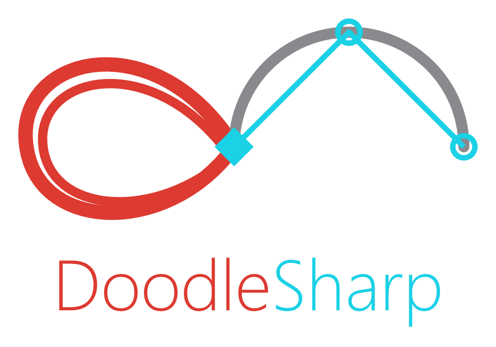

  

# DoodleSharp: write the geometry, see the geometry

### And why I'm retiring Code2Viz to get here

---

> **Publishing note.** LinkedIn's article editor does not accept Markdown. Paste the prose section by
> section and use its own heading / quote / code-block controls, then upload the four images from
> this folder at the marked points. `logo.png` works as the article's cover image. Everything below
> is written to survive that: no inline emphasis that would paste as stray asterisks, and every
> figure has a caption you can paste into the image caption field.

---

There is a particular kind of frustration that comes from writing geometry code you cannot see.

You have an algorithm — a packing, a subdivision, an offset, a visibility graph. You know what it is
supposed to look like. What you have instead is a list of coordinates in a debugger, and a growing
suspicion that vertex 47 is in the wrong place. So you write a throwaway exporter, open the result in
something else, squint at it, change one number, and do it all again.

I got tired of that loop. DoodleSharp is what I built instead.

Write C# geometry. Press F5. See it.

---

## The premise, and why it is narrow on purpose

DoodleSharp is a Windows app with a C# editor on one side and a drawing canvas on the other. You
write ordinary C# against a geometry library. You press F5. The shapes appear.

There is no scene graph to populate and no render call to remember. Constructing a shape is what puts
it on the canvas:

    var circle = new VCircle(new VXYZ(0, 0), 50);
    var line   = new VLine(new VXYZ(-80, 0), new VXYZ(80, 0));

That is the whole ceremony. The library underneath is not a toy — boolean operations and offsets go
through Clipper2, ray queries run against a BVH, and there are regions, hatches, splines, dimensions
and chart builders. But the surface stays deliberately small, because the point is the loop: think,
type, look, adjust.

Underneath the app sits a single geometry assembly with no UI dependency at all. It does not know
what WPF is. That separation is why the app can be rebuilt without touching the maths, which is
exactly what happened next.

---

## What Code2Viz taught me

Code2Viz was the first version of this idea, and it worked. It also grew three heads.

There was the main app. There was a separate Animator executable — a p5.js-style sketch environment,
its own window, its own project model, launched by a "Switch to Animator" button that closed one app
and opened the other. And there was a web port.

Each addition was defensible on its own. Together they meant every feature had to be considered three
times, and the two secondary heads consumed attention the primary one needed. The sketch environment
was genuinely good, and being a separate program made it feel like a different product rather than a
different mode.

The other thing Code2Viz taught me is that a visualiser is only as useful as the number of things it
can show you at once. And it could show you exactly one.

---

## The canvas is no longer one canvas

This is the change that made DoodleSharp worth naming separately.

    Viewports.Rows = 2;
    Viewports.Columns = 3;

    new VCircle(new VXYZ(0, 0), 10).Place(Viewports[0][0]);
    new VLine(new VXYZ(-20, 0), new VXYZ(20, 0)).Place(Viewports[1][2]);

Six canvases. Six independent views. Each one pans and zooms on its own, keeps its own selection, and
holds its position when you press F5 again — so you can leave one cell zoomed into a detail while
another shows the whole drawing.

**[FIGURE 1 — viewports-showcase.png]**
*Caption: Four studies, four coordinate spaces. A rose curve at left; harmonics, hexagonal packing
and a {9/4} star polygon in a subdivided right-hand column. Each cell zoom-fits its own contents, so
the four drawings appear at four different scales despite living in similar coordinates.*

Before this, showing three variants side by side meant offsetting each one by hand into a different
region of a single coordinate space and hoping they never overlapped. One of my own sample projects
still does exactly that — it plants three algorithms at x = -300, x = 0 and x = +300 and calls it a
layout. That workaround is what Viewports removes.

Any cell can be split again, so an uneven layout is simply a subdivided cell:

    Viewports.Columns = 2;
    Viewport right = Viewports[0][1];
    right.Rows = 3;
    new VPolygon(new VXYZ(0, 0), new VXYZ(10, 0), new VXYZ(0, 10)).Place(right[1][0]);

**[FIGURE 2 — viewports-nested.png]**
*Caption: One large view beside a column of three. Nesting is what makes uneven layouts expressible
without a special case — the right-hand cell is just a viewport that was divided again.*

Rows and columns are sized the way XAML sizes a grid, because that spelling is already in the fingers
of everyone likely to use this:

    Viewports[0].Height = "3*";      // this row takes three shares of the height
    Viewports[0][2].Width  = "4*";   // this column takes four
    Viewports[0][0].Width  = "240";  // or a fixed pixel width

**[FIGURE 3 — viewports-sizing.png]**
*Caption: Star sizing. The top row was given "3*" against the bottom row's default "*", so it takes
three quarters of the height; the last column was given "4*" against two defaults, so it takes four
sixths of the width.*

A couple of decisions in there are worth stating, because they are the sort you cannot guess from an
API's shape:

Indices are 0-based and row-first, matching the rest of C#. A single undivided viewport's only cell
is itself — so on the default layout `Viewports[0][0]` *is* the whole canvas, which is why a bare
`Place()` and `Place(Viewports[0][0])` mean the same thing with no special case anywhere in the code.
And the layout resets on every run, exactly like shape IDs do, so what is on screen always matches
what the source says. Delete the line that divided the canvas and the next run is whole again.

Export understands all of it. A divided drawing exports as one image, SVG or PDF, tiled exactly as it
appears — each cell clipped and transformed at its own zoom. An undivided drawing exports through the
same path it always did, unchanged.

---

## Drawings you can poke

A visualiser that only draws is a picture. Code2Viz had no mouse API at all.

DoodleSharp has one, and it borrows its shape from the browser, because that shape is already
familiar:

    var readout = new VText(new VXYZ(-90, 90), "");

    Mouse.OnMove(e => readout.Content = $"{e.Position.X:F1}, {e.Position.Y:F1}");

    Mouse.OnClick(e =>
    {
        if (e.Target is VCircle c) c.FillColor = "Orange";
    });

Every event hands you world coordinates, the modifier keys, and — computed only if you ask for it —
the shape under the cursor. Registering a handler hands the canvas's own gestures over to your code,
so a drawing can become a tool: click to seed a Voronoi cell, drag to steer a curve, scroll to step
through iterations.

For motion there is a second seam, and it is deliberately not the animation timeline:

    void Spin(double seconds)
    {
        hand.RotationAngle = seconds * 90;   // degrees
        Frame.Request(Spin);                 // ask for the next frame
    }

    Frame.Request(Spin);

That is the `requestAnimationFrame` model — a callback that asks for the next frame to keep going,
and simply stops asking when it wants to end. It is all that open-ended or procedural motion needs. The timeline is still
there, and still the right tool when you want an animation you can scrub, seek and export to GIF or
MP4, because those need time to be a value you can jump to rather than a thing that only moves
forward.

Between them, the animation story is now stronger than the standalone Animator's was — and it lives
in the same window as everything else.

---

## Fast enough to be honest

A visualiser that stutters is a visualiser you stop trusting, because you start wondering whether
what you are seeing is the drawing or the renderer giving up.

DoodleSharp has three renderers. WPF's vector path, which is exact and the behaviour everything was
authored against. A software rasteriser written for this app, which exists because "one device pixel,
no anti-aliasing, opaque over opaque" is the one case where a general rasteriser's machinery is all
overhead. And a Direct3D 11 backend that uploads geometry once in world coordinates, so panning and
zooming cost almost nothing.

The app picks between them per frame, because none of the three wins outright. The GPU path holds
around 100,000 shapes at 4K in under four milliseconds a frame on my benchmark scenes. Level-of-detail
substitution took the worst frame of a dense hatched drawing from about a second to under four
milliseconds — a hatch is the one shape whose cost is unbounded by its size on screen, so a
thumbnail-sized parcel can otherwise submit tens of thousands of strokes that all land on pixels
another stroke already covered.

Press F10 and it shows you its own frame timings. I put that in because I did not want to be able to
fool myself.

---

## A workspace, not a window

Code2Viz had a fixed layout with a properties panel that could float. DoodleSharp's panels all dock,
tab, and tear off: editor on one monitor, canvas on the other, console wherever you like it. Ctrl+R
puts everything back when an experiment goes wrong.

The canvas grid lives inside a single pane, which means the whole viewport arrangement travels with
it when you float it or drag it to another screen.

---

## The small things that took the longest

Most of the work in a tool like this is not the headline feature.

Z-order used to be "put this shape above that one" — a call whose result depended on the order you
happened to make the calls in, and which the next shape you constructed could undo. It is now a
single `ZIndex` property. "This label is always on top" became something you can state rather than
arrange.

Text now masks itself in the canvas colour by default, so a label stays readable where it crosses
geometry instead of disappearing into it.

And if you name a project "Mouse", the app tells you `Mouse is a keyword. try another name`, pointing
at the declaration — rather than the compiler blaming the line that tried to use it, which is where
the error surfaces and is never where the fix belongs.

None of those is a headline. All of them are the difference between a demo and a tool.

---

## What I removed

The separate Animator executable is gone. Its sketch model — `Setup()` once, `Draw()` every frame —
now runs inside DoodleSharp as a mode. Same idea, one fewer program, and it shares the editor,
console, export and geometry with everything else.

The web port is gone too. It was a plausible idea that turned out to cost more attention than it
returned.

One app, not three. That is the whole reorganisation, and it is why the remaining one got better.

---

## Code2Viz is retired

Code2Viz will not be developed further.

If you have been using it: everything it did well came across. The geometry library is the same one.
The editor, the charts, the boolean operations, the global parameters with live sliders that write
values back into your source, the crash journals that make a bug report from another machine
diagnosable from a single file — all still here, and most of them improved.

What did not come across is the part that was splitting my attention three ways. I would rather have
one tool that keeps getting better than three that each get a third of the care.

---

## Getting it

DoodleSharp is MIT licensed and runs on .NET 9 on Windows.

**github.com/harilalmn/DoodleSharp**

The repository has the source, an installer on the releases page, and API documentation that is
regenerated and verified against the built assemblies every release — a habit I picked up after
discovering the docs had confidently described methods that did not exist.

If you think in geometry and would rather see it than picture it in your head, I would genuinely
like to know what you build with it — and what it is missing.

---

*Tags: #dotnet #csharp #wpf #geometry #computationaldesign #creativecoding #devtools #opensource
#generativeart #aec*
